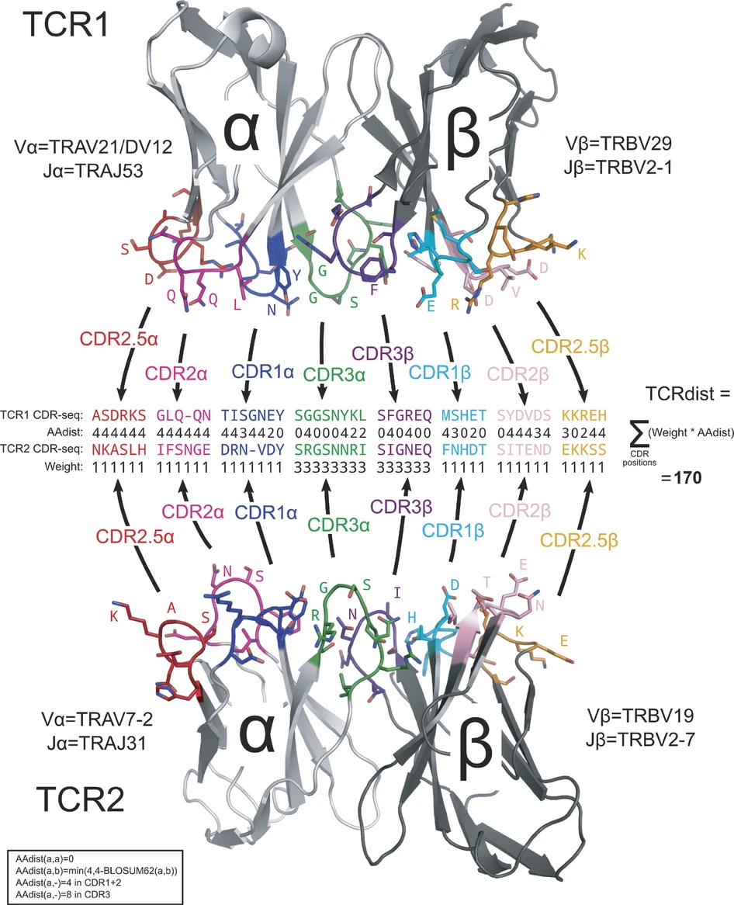

# Fast TCR similarity calculation with TCRdist GPU

## What is TCRdist?

TCRdist ([Dash et al., Nature
2017](https://doi.org/10.1038/nature22383)) quantifies the similarity
between two T-cell receptors based on the concordance of their amino
acid sequences in regions important for antigen recognition. The
algorithm computes a weighted [Hamming
distance](https://en.wikipedia.org/wiki/Hamming_distance) between two
TCRs, using a [BLOSUM62 substitution
matrix](https://www.labxchange.org/library/items/lb:LabXchange:24d0ec21:lx_image:1)
to penalize amino acids mismatches between V/J segments and CDR3 loops.

|  |
|:-------------------------------------------:|
|          *A schematic of TCRdist.*          |

## Why is TCRdist important?

TCRdist can be used to discover clusters of similar TCRs associated with
response to an antigen. When combined with databases of known TCRs
associated with certain viruses and epitopes, like
[VDJ-db](https://vdjdb.cdr3.net/) and
[metaCoNGA](https://www.biorxiv.org/content/10.1101/2025.05.31.657155v1),
TCRdist can be used to label virus/epitope-specific TCRs and currently
unknown TCRs. With reverse epitope discovery techniques, experimental
methods can be used to discover the epitopes targeted by these
antigen-responsive TCR clusters.

## Why do we need another TCRdist implementation?

TCRdist was originally implemented in Python
([tcr-dist](https://github.com/phbradley/tcr-dist)), but **computation
becomes very slow when calculating pairwise TCRdist values for thousands
of TCRs**. Efforts to speed up TCRdist calculation in Python have been
made using [numba](https://numba.pydata.org/), a high-performance
just-in-time (JIT) compiler
([tcrdist3](https://github.com/kmayerb/tcrdist3)), Cython, which
compiles Python code into fast C code
([fast_tcrdist](https://github.com/villani-lab/fast_tcrdist)), and
standard C++ ([CoNGA](https://github.com/phbradley/conga)). These faster
implementations work well for paired TCR datasets up to ~100k TCRs,
which has been more than sufficient thus far.

However, **with TIRTLseq it has become possible to rapidly and cheaply
generate even larger paired TCR datasets** and computation time scales
quadratically with the number of TCRs, **calculating TCRdist becomes
prohibitively slow for hundreds of thousands to 1 million+ TCRs**. To
address this, we leveraged GPU computation, which can significantly
outperform compiled C++ executed on a CPU.

**We wrote a GPU-enabled TCRdist implementation in Python (with an R
wrapper) that is faster than all other existing implementations** and is
suitable for use with extra-large datasets of paired TCRs. It is
**efficient (minutes to hours) for datasets of 100k to 1 million+ TCRs**
and **super-fast (seconds) for datasets of 10k to 100k TCRs**. It
batches computation, keeps results in sparse format, and can
progressively write results to a text file rather than returning a
cumbersomely large data object.

Our implementation is compatible with both NVIDIA and Apple Silicon GPUs
and automatically detects a user’s GPU type. It uses
[cupy](https://cupy.dev/) (for NVIDIA GPUs) or
[mlx](https://ml-explore.github.io/mlx/build/html/index.html) (for Apple
Silicon GPUs) to compute pairwise TCRdist for each batch of TCRs, using
[numpy](https://numpy.org/) as a backup when no GPU is available.

**The
[`TCRdist()`](https://nicholasclark.github.io/TIRTLtools/reference/TCRdist.md)
function in `TIRTLtools`is a wrapper that allows us to run this fast GPU
implementation via R using the
[reticulate](https://rstudio.github.io/reticulate/) package.**

## Notes on our implementation

- Your input data frame must include the following columns (it may
  include additional columns):
  - `va` - V-segment for alpha chain
  - `cdr3a` - CDR3 amino acid sequence for alpha chain
  - `vb` - V-segment for beta chain
  - `cdr3b` - CDR3 amino acid sequence for beta chain
- Our implementation currently ignores J-segments and calculates
  similarity based on only V-segment and CDR3 amino acid sequence.
- Our implementation currently does not align CDR3 segments. It pads all
  CDR3 amino acid sequences in the center with blanks to a common length
  (29 AA) and penalizes mismatches between the two sequences.
- Our implementation currently requires V-segments and CDR3 sequences
  for both alpha and beta chains. If you have single-chain data only,
  you can insert dummy values in the V and CDR3 columns for the missing
  chain to allow for compatibility with our function.
- Our implementation uses a pre-calculated substitution matrix for amino
  acids and V-segments. TCRs whose amino acid sequences contain stop
  codons (\*) or frameshifts (\_) and TCRs with V-segments that are not
  found in the substitution matrix will be dropped. For a list of
  permitted amino acids and V-segments, see
  `TIRTLtools::params$feature`.
- Our V-segments include an allele identifier, e.g. “TRAV13-1\*03”. If
  some or all of your V-segments do not include alleles, the function
  will automatically add “\*01” to them.
- You may also run TCRdist directly in Python
  <https://github.com/NicholasClark/TCRdist_gpu>. However, the steps
  above of preparing the data (dropping improper TCRs and adding
  alleles) are not part of the Python function, so you may want to run
  [`prep_for_tcrdist()`](https://nicholasclark.github.io/TIRTLtools/reference/prep_for_tcrdist.md)
  on your data first and write that data frame to a file.
- We discard large TCRdist values (\>= some cutoff, default 90) and
  return a dataframe where each row contains one TCRdist value for a
  pair of TCRs.

## TCRdist example

### Load the package

``` r
library(TIRTLtools)
library(dplyr)
library(rmarkdown)
```

### Load a paired TCR dataset

For an example, we load paired TCRs from TIRTLseq experiments using CD4
and CD8-isolated T-cell samples taken from COVID-19-infected patients at
three timepoints as part of the St. Jude Tracking Study of Immune
Responses Associated with COVID-19 (SJTRC).

``` r
## This loads a TIRTLseqDataSet object called "SJTRC_longitudinal"
load_example_data("SJTRC_longitudinal")
```

    ## Loading file: SJTRC_longitudinal.qs2...

    ## 36.702 sec elapsed

``` r
SJTRC_longitudinal$meta %>%
  mutate(label = paste(substr(label, 0, 20), "...", sep = "")) %>%
  paged_table()
```

We can use the
[`get_all_tcrs()`](https://nicholasclark.github.io/TIRTLtools/reference/get_all_tcrs.md)
function to get a data frame with paired TCRs from all samples. You can
optionally remove MAIT TCRs, which share an invariant alpha-chain and
thus often have lower TCRdist values, forming dense clusters which we
may not be interested in.

After filtering, we have ~100k TCRs.

``` r
all_tcrs = get_all_tcrs(SJTRC_longitudinal)
input_tcrs = all_tcrs %>% prep_for_tcrdist(remove_MAIT = TRUE)
```

    ## Removed 1,755 TCRs with unknown V-segments (1.1%) from a total of 165,671 TCRs.

    ## Removed 78 TCRs with short CDR3 segments (0.048%) from a total of 163,916 TCRs.

    ## Removed 59,996 TCRs with non-functional CDR3 amino acid sequences (37%) from a total of 163,838 TCRs.

    ## Removed 1,321 MAIT TCRs (1.3%) from a total of 103,842 TCRs.

    ## Filtered data frame contains 102,521 TCRs (62%) of original 165,671 TCRs.

``` r
### note: You may replace this with a file of your choice - needs to have columns "va", "vb", "cdr3a", and "cdr3b"

input_tcrs %>%
  mutate(alpha_nuc = paste(substr(alpha_nuc, 0, 20), "...", sep = ""),
         beta_nuc = paste(substr(beta_nuc, 0, 20), "...", sep = "")) %>%
  arrange(desc(wij)) %>%
  paged_table()
```

### Run TCRdist

TCRs are processed in chunks (default 1000). For a dataset of this size
(~100k TCRs), computation on a laptop with an Apple Silicon M4 Pro GPU
takes about 30 seconds.

``` r
### This function will attempt to automatically install a Python environment with necessary packages for GPU computation
result = TCRdist(tcr1 = input_tcrs, tcrdist_cutoff = 90, chunk_size = 1000)
```

    ## Removed 0 TCRs with unknown V-segments (0%) from a total of 102,521 TCRs.

    ## Removed 0 TCRs with short CDR3 segments (0%) from a total of 102,521 TCRs.

    ## Removed 0 TCRs with non-functional CDR3 amino acid sequences (0%) from a total of 102,521 TCRs.

    ## Filtered data frame contains 102,521 TCRs (100%) of original 102,521 TCRs.

    ## ℹ Number of chunks: 5356

    ## ℹ 10% done — time taken so far: 4.98 seconds

    ## ℹ 20% done — time taken so far: 9.51 seconds

    ## ℹ 30% done — time taken so far: 14.03 seconds

    ## ℹ 40% done — time taken so far: 18.07 seconds

    ## ℹ 50% done — time taken so far: 22.6 seconds

    ## ℹ 60% done — time taken so far: 27.62 seconds

    ## ℹ 70% done — time taken so far: 31.73 seconds

    ## ℹ 80% done — time taken so far: 36.3 seconds

    ## ℹ 90% done — time taken so far: 40.87 seconds

    ## ℹ 100% done — time taken so far: 45.19 seconds

    ## ✔ Total time taken: 45.19 seconds

### Inspect the output

The function returns a “list” with two slots:

- `edges_df` - a dataframe with 3 columns (“node1_idx”, “node2_idx”,
  “TCRdist”), containing all TCRdist values \<= cutoff (default 90) in
  sparse format. Each row contains the TCRdist value between two TCRs
  identified by their indices. This may be thought of as a dataframe of
  “edges” between “nodes” (TCRs) in a network.
- `nodes_df` - The dataframe with input TCRs, their assigned indices,
  and any other metadata. The TCR indices, starting from 1, are found in
  the `tcr_index` column. Note that this dataframe may have fewer rows
  than the input because some TCRs with non-functional CDR3s or
  non-standard V-segments may have been removed.

When calculating TCRdist between two different sets of TCRs (tcr1 and
tcr2), `nodes_df` contains both: tcr1’s rows are numbered first, and
tcr2’s `tcr_index` values continue on immediately after the highest
`tcr_index` in tcr1.

**Note: TCRs are assigned indices starting at 1 (R-style)**

``` r
edge_df = result[['edges_df']] ### table of TCRdist values <= cutoff
node_df = result[['nodes_df']] ### table of input data with indices

node_df %>% 
  select(tcr_index, everything()) %>%
  mutate(alpha_nuc = paste(substr(alpha_nuc, 0, 20), "...", sep = ""),
         beta_nuc = paste(substr(beta_nuc, 0, 20), "...", sep = "")) %>%
  paged_table()
```

``` r
edge_df %>% paged_table()
```

``` r
nrow(edge_df) # ~75k edges
```

    ## [1] 75715

For this dataset of ~100k TCRs, we detect ~75k relationships between
similar TCRs (TCRdist \<= 90). For any row of the output table, we can
view the two TCRs:

``` r
row_idx = 1
node_df %>% 
  filter(tcr_index %in% c(edge_df$node1_idx[row_idx], edge_df$node2_idx[row_idx])) %>%
  select(va, ja, cdr3a, cdr3b, vb, jb) %>%
  paged_table()
```
