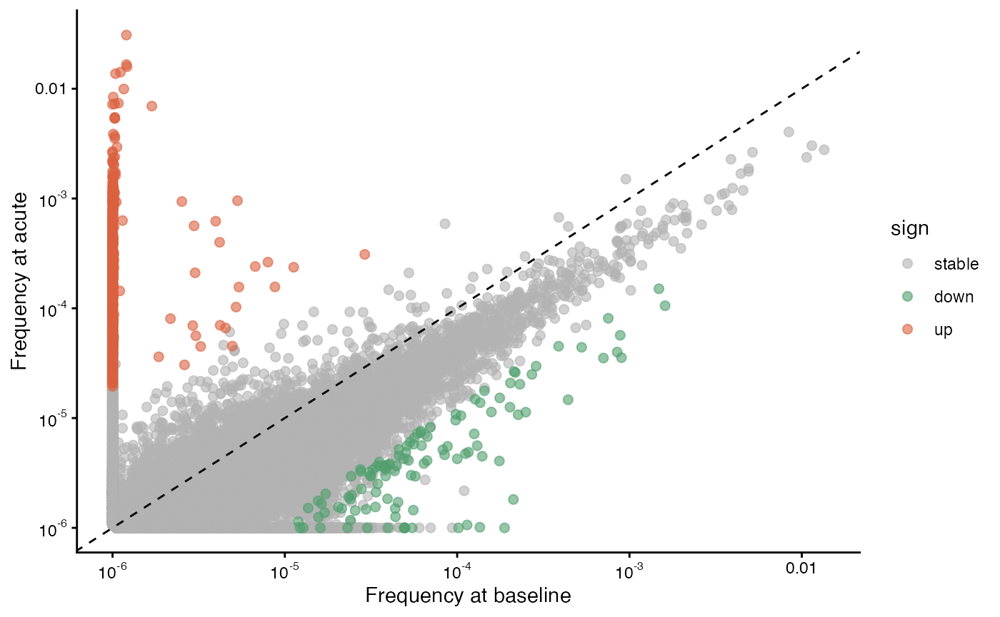
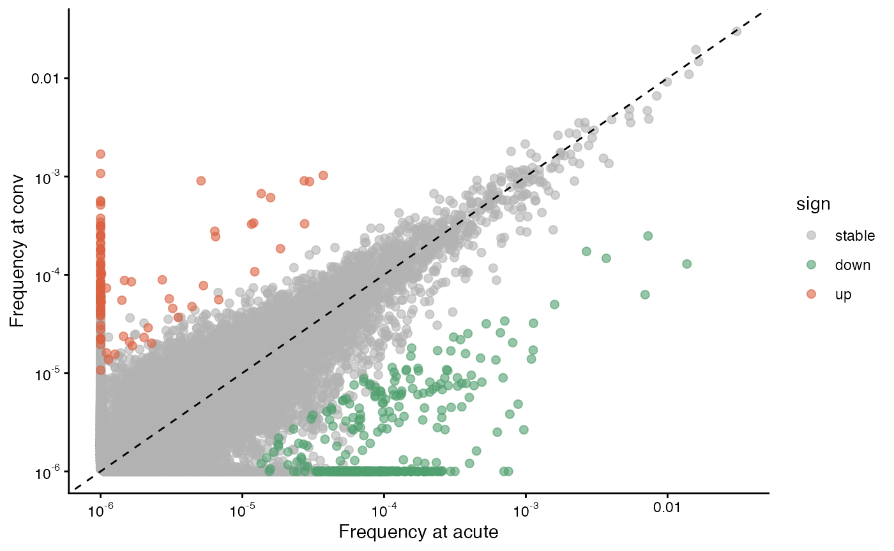
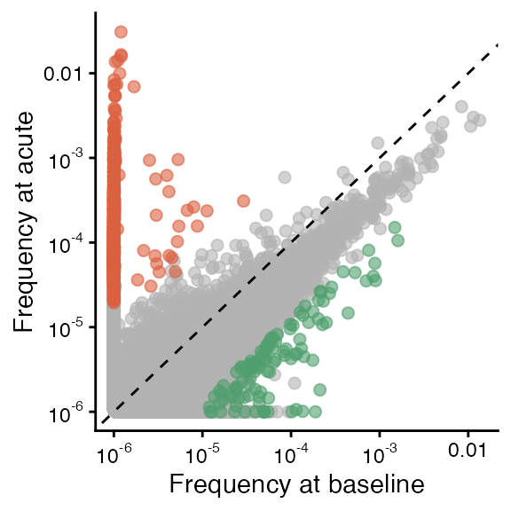
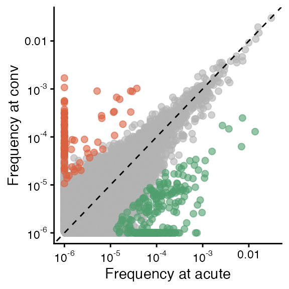

# Pairing of alpha/beta TCR chains

## Tutorial overview

This vignette shows how to generate paired TCR and single-chain
“pseudo-bulk” data using raw TIRTLseq TCR-alpha/beta read counts from
half of a 384-well plate. We find TCR pairs for CD8+ T-cells isolated
from patient samples before and after naturally acquired SARS-CoV-2
infection and re-create a figure from the [TIRTLseq
paper](http://doi.org/10.1038/s41592-025-02907-9) showing changes in the
patient’s TCR repertoire over time.

## Study details

For this example, we use data from the St. Jude Tracking Study of Immune
Responses Associated with COVID-19 (SJTRC), a clinical trial launched in
2020 to study the T-cell receptor repertoires of adults with naturally
acquired COVID-19. This was a prospective, longitudinal cohort study
involving adult employees (18 years and older) at St. Jude Children’s
Research Hospital in Memphis, TN, USA.

Participants underwent weekly PCR screening for SARS-CoV-2 infection
while on the St. Jude campus. Blood samples were collected in 8-ml cell
preparation tubes, processed within 24 h into cellular and plasma
components, aliquoted and then frozen for future analysis.

Here, we use samples from a healthy 33-year-old female donor with
naturally acquired mild SARS-CoV-2 infection and no prior history of
SARS-CoV-2 infection or vaccination. Samples were collected 143 days
before this donor’s first positive SARS-CoV-2 PCR test (`baseline`
sample), 6 days after (`acute` sample) and 29 days after (`convalescent`
sample).

## Instructions

### Download data

You will need to download the data from
[Zenodo](https://zenodo.org/records/14010377) before running this code.
The data we are using is `exp3_clones.tar.gz`, which includes well-level
TIRTLseq data from three 384-well plates. You will need to unzip the
tar.gz file as well as the data for each plate.

Note: These are large files. The tar.gz file is 1.4 GB and the
uncompressed data is 7.8 GB.

### Set up input/output directories

Change the folder locations in the following code block to the directory
with your downloaded and unzipped data (`folder`) and the directory you
would like to save the paired TCR output to (`save_folder`).

``` r
folder = "~/Downloads/zenodo/exp3_clones/" ### change this to the directory with your downloaded data!
save_folder = "~/git/TIRTLtools/extra/exp3_cd8" ### change this to the folder you would like to save paired output in (if the folder does not exist it will be created)
```

### Select plate rows and columns

CD4+ and CD8+ T-cells were isolated from peripheral blood mononuclear
cells (PBMCs) in each sample. For each timepoint, CD8+ cells were plated
on the left half of wells in a 384-well plate and CD4+ cells were plated
on the right half.

In this case, we will pair the CD8+ cells, so we select columns 1
through 12 (the left half of the plate) and rows 1 through 16 (or A
through P, all rows).

``` r
library(TIRTLtools)
```

    ## Loading required package: ggplot2

``` r
tp1 = file.path(folder, "TCR_clones_ID02") ## baseline (pre-infection)
tp2 = file.path(folder, "TCR_clones_ID03") ## acute (6 days after infection)
tp3 = file.path(folder, "TCR_clones_ID04") ## convalescent (29 days after infection)

cd8_wells = get_well_subset(row_range = 1:16, col_range = 1:12) ## left half of the plate (CD8+)
```

### Run pairing algorithms

The
[`run_pairing()`](https://nicholasclark.github.io/TIRTLtools/reference/run_pairing.md)
function will run the pairing scripts, which implement the MAD-HYPE and
T-SHELL algorithms. These algorithms are implemented in Python using
GPU-accelerated packages (with numpy as a CPU-only backup) for fast
calculation. The package should automatically install a python
environment with the necessary packages and detect the GPU type (NVIDIA
or Apple Silicon) of your machine, if it has one available.

Each function call may take a few minutes to run.

The main arguments of the function are:

- `folder_path` - the path of the folder with well-level data
- `folder_out` - the path of the folder to write results to (the
  function will create the folder if it does not exist)
- `prefix` - a prefix (e.g. the sample name) for the output file names
- `well_filter_thres` - a threshold on the number of unique clones found
  in a well, for quality control
- `well_pos` - the position of the well ID (e.g. “B5”) in the file
  names.
- `wellset1` - a vector of wells to use for the pairing.

For more information, check the documentation with
[`?run_pairing`](https://nicholasclark.github.io/TIRTLtools/reference/run_pairing.md).

The well-level data files in each folder are named something like
`MVP113_TIRTLseq_P12_S263.TCRa_ID02.clones_TRA.tsv`, so the well ID
(`P12` in this case) is in the third position (separate by underscores)
so we use `well_pos=3`. We use the
[`get_well_subset()`](https://nicholasclark.github.io/TIRTLtools/reference/get_well_subset.md)
function above to generate the vector of wells for the left side of the
plate. With this, we run the
[`run_pairing()`](https://nicholasclark.github.io/TIRTLtools/reference/run_pairing.md)
function, saving the output from CD8+ cells in each plate to the same
folder, with a different prefix for each:
`<experiment>_<timepoint>_<marker>`.

``` r
### This function will attempt to automatically install a Python environment with necessary packages for GPU computation
run_pairing(folder_path = tp1, folder_out = save_folder, prefix = "exp3_tp1_cd8", well_filter_thres = 0.5,
          well_pos = 3, wellset1 = cd8_wells)
```

    ## [1] "Folder already exists: ~/git/TIRTLtools/extra/exp3_cd8"

    ## Reading 384 files from ~/Downloads/zenodo/exp3_clones//TCR_clones_ID02

    ## 25 of 384 files loaded

    ## 50 of 384 files loaded

    ## 75 of 384 files loaded

    ## 100 of 384 files loaded

    ## 125 of 384 files loaded

    ## 150 of 384 files loaded

    ## 175 of 384 files loaded

    ## 200 of 384 files loaded

    ## 225 of 384 files loaded

    ## 250 of 384 files loaded

    ## 275 of 384 files loaded

    ## 300 of 384 files loaded

    ## 325 of 384 files loaded

    ## 350 of 384 files loaded

    ## 375 of 384 files loaded

    ## 384 of 384 files loaded

    ## 192 TCRalpha well files loaded

    ## 192 TCRbeta well files loaded

    ## Total number of TCRalpha reads: 6.86e+07

    ## Total number of TCRbeta reads: 9.83e+07

    ## Total number of unique TCRalpha chains: 937880

    ## Total number of unique TCRbeta chains: 928782

    ## 1 out of 192 wells removed by QC: P3

    ## Clone threshold for QC: 3217

    ## Alpha wells passing QC: 191

    ## Beta wells passing QC: 191

    ## Alpha wells failing QC: 1

    ## Beta wells failing QC: 1

    ## Tabulating TCRalpha pseudobulk counts

    ## Writing TCRalpha pseudobulk file... exp3_tp1_cd8_pseudobulk_TRA.tsv

    ## Tabulating TCRbeta pseudobulk counts

    ## Writing TCRbeta pseudobulk file... exp3_tp1_cd8_pseudobulk_TRB.tsv

    ## Pseudobulk done

    ## Merging alpha clonesets...

    ## Done! Unique alpha clones after filtering: 937875

    ## Unique alpha clones in more than 2 wells: 36679

    ## Done! Unique beta clones after filtering: 928777

    ## Unique beta clones and wells in more than 2 wells: 36080

    ## Pre-computing look-up table:

    ##   |                                                                              |                                                                      |   0%  |                                                                              |                                                                      |   1%  |                                                                              |=                                                                     |   1%  |                                                                              |=                                                                     |   2%  |                                                                              |==                                                                    |   3%  |                                                                              |===                                                                   |   4%  |                                                                              |===                                                                   |   5%  |                                                                              |====                                                                  |   5%  |                                                                              |====                                                                  |   6%  |                                                                              |=====                                                                 |   7%  |                                                                              |=====                                                                 |   8%  |                                                                              |======                                                                |   8%  |                                                                              |======                                                                |   9%  |                                                                              |=======                                                               |   9%  |                                                                              |=======                                                               |  10%  |                                                                              |========                                                              |  11%  |                                                                              |========                                                              |  12%  |                                                                              |=========                                                             |  13%  |                                                                              |==========                                                            |  14%  |                                                                              |==========                                                            |  15%  |                                                                              |===========                                                           |  15%  |                                                                              |===========                                                           |  16%  |                                                                              |============                                                          |  17%  |                                                                              |============                                                          |  18%  |                                                                              |=============                                                         |  18%  |                                                                              |=============                                                         |  19%  |                                                                              |==============                                                        |  19%  |                                                                              |==============                                                        |  20%  |                                                                              |===============                                                       |  21%  |                                                                              |===============                                                       |  22%  |                                                                              |================                                                      |  23%  |                                                                              |================                                                      |  24%  |                                                                              |=================                                                     |  24%  |                                                                              |=================                                                     |  25%  |                                                                              |==================                                                    |  25%  |                                                                              |==================                                                    |  26%  |                                                                              |===================                                                   |  27%  |                                                                              |===================                                                   |  28%  |                                                                              |====================                                                  |  28%  |                                                                              |====================                                                  |  29%  |                                                                              |=====================                                                 |  29%  |                                                                              |=====================                                                 |  30%  |                                                                              |======================                                                |  31%  |                                                                              |======================                                                |  32%  |                                                                              |=======================                                               |  32%  |                                                                              |=======================                                               |  33%  |                                                                              |=======================                                               |  34%  |                                                                              |========================                                              |  34%  |                                                                              |========================                                              |  35%  |                                                                              |=========================                                             |  35%  |                                                                              |=========================                                             |  36%  |                                                                              |==========================                                            |  37%  |                                                                              |==========================                                            |  38%  |                                                                              |===========================                                           |  38%  |                                                                              |===========================                                           |  39%  |                                                                              |============================                                          |  40%  |                                                                              |=============================                                         |  41%  |                                                                              |=============================                                         |  42%  |                                                                              |==============================                                        |  42%  |                                                                              |==============================                                        |  43%  |                                                                              |===============================                                       |  44%  |                                                                              |===============================                                       |  45%  |                                                                              |================================                                      |  45%  |                                                                              |================================                                      |  46%  |                                                                              |=================================                                     |  47%  |                                                                              |=================================                                     |  48%  |                                                                              |==================================                                    |  48%  |                                                                              |==================================                                    |  49%  |                                                                              |===================================                                   |  50%  |                                                                              |====================================                                  |  51%  |                                                                              |====================================                                  |  52%  |                                                                              |=====================================                                 |  52%  |                                                                              |=====================================                                 |  53%  |                                                                              |======================================                                |  54%  |                                                                              |======================================                                |  55%  |                                                                              |=======================================                               |  55%  |                                                                              |=======================================                               |  56%  |                                                                              |========================================                              |  57%  |                                                                              |========================================                              |  58%  |                                                                              |=========================================                             |  58%  |                                                                              |=========================================                             |  59%  |                                                                              |==========================================                            |  60%  |                                                                              |===========================================                           |  61%  |                                                                              |===========================================                           |  62%  |                                                                              |============================================                          |  62%  |                                                                              |============================================                          |  63%  |                                                                              |=============================================                         |  64%  |                                                                              |=============================================                         |  65%  |                                                                              |==============================================                        |  65%  |                                                                              |==============================================                        |  66%  |                                                                              |===============================================                       |  66%  |                                                                              |===============================================                       |  67%  |                                                                              |===============================================                       |  68%  |                                                                              |================================================                      |  68%  |                                                                              |================================================                      |  69%  |                                                                              |=================================================                     |  70%  |                                                                              |=================================================                     |  71%  |                                                                              |==================================================                    |  71%  |                                                                              |==================================================                    |  72%  |                                                                              |===================================================                   |  72%  |                                                                              |===================================================                   |  73%  |                                                                              |====================================================                  |  74%  |                                                                              |====================================================                  |  75%  |                                                                              |=====================================================                 |  75%  |                                                                              |=====================================================                 |  76%  |                                                                              |======================================================                |  76%  |                                                                              |======================================================                |  77%  |                                                                              |=======================================================               |  78%  |                                                                              |=======================================================               |  79%  |                                                                              |========================================================              |  80%  |                                                                              |========================================================              |  81%  |                                                                              |=========================================================             |  81%  |                                                                              |=========================================================             |  82%  |                                                                              |==========================================================            |  82%  |                                                                              |==========================================================            |  83%  |                                                                              |===========================================================           |  84%  |                                                                              |===========================================================           |  85%  |                                                                              |============================================================          |  85%  |                                                                              |============================================================          |  86%  |                                                                              |=============================================================         |  87%  |                                                                              |==============================================================        |  88%  |                                                                              |==============================================================        |  89%  |                                                                              |===============================================================       |  90%  |                                                                              |===============================================================       |  91%  |                                                                              |================================================================      |  91%  |                                                                              |================================================================      |  92%  |                                                                              |=================================================================     |  92%  |                                                                              |=================================================================     |  93%  |                                                                              |==================================================================    |  94%  |                                                                              |==================================================================    |  95%  |                                                                              |===================================================================   |  95%  |                                                                              |===================================================================   |  96%  |                                                                              |====================================================================  |  97%  |                                                                              |===================================================================== |  98%  |                                                                              |===================================================================== |  99%  |                                                                              |======================================================================|  99%  |                                                                              |======================================================================| 100%

    ## Running pairing algorithms...

    ## Checking for available GPU...
    ## 
    ## Apple Silicon GPU detected:
    ## Apple Silicon GPU (M1/M2/M3)
    ## Checking for GPU-related Python modules...
    ## 
    ## 'mlx' is installed (for Apple Silicon GPUs).
    ## Loading mlx
    ## total number of chunks 73
    ## start time for MAD-HYPE: 2026-06-15 13:26:33
    ## Progress: 3500 (10%)
    ## Progress: 7000 (20%)
    ## Progress: 14500 (40%)
    ## Progress: 18000 (50%)
    ## Progress: 22000 (60%)
    ## Progress: 25500 (70%)
    ## Progress: 33000 (90%)
    ## Progress: 36500 (100%)
    ## end time for MAD-HYPE: 2026-06-15 13:26:37
    ## Number of pairs: 13379
    ## total number of chunks 73
    ## start processing time for T-Shell: 2026-06-15 13:26:37
    ## Progress: 3500 (10%)
    ## Progress: 7000 (20%)
    ## Progress: 14500 (40%)
    ## Progress: 18000 (50%)
    ## Progress: 22000 (60%)
    ## Progress: 25500 (70%)
    ## Progress: 33000 (90%)
    ## Progress: 36500 (100%)
    ## end time for T-Shell: 2026-06-15 13:26:40

    ## Pairing is finished.

    ## [1] "Filtering results, adding amino acid and V segment information..."
    ## [1] "Scoring unique pairs..."

    ## Writing TCRalpha/beta pairs... exp3_tp1_cd8_TIRTLoutput.tsv

    ## All pairing is finished!

    ## Number of clones paired by MAD-HYPE algorithm: 13379

    ## Number of clones paired by T-SHELL algorithm: 7304

    ## Total number of unique TCRalpha/beta pairs: 14270

    ## 79.748 sec elapsed

    ## Key: <wi, wj, wij>
    ##           wi    wj   wij                                           alpha_nuc
    ##        <num> <num> <num>                                              <char>
    ##     1:     0     3    85          TGTGCAATGAGTTTTAACTTTGGAAATGAGAAATTAACCTTT
    ##     2:     1     0    56             TGTGCTGGACATACCGGCACTGCCAGTAAACTCACCTTT
    ##     3:     1     0    56 TGTGCAGGAGCGGAGGATGCTGGTGGTACTAGCTATGGAAAGCTGACATTT
    ##     4:     0     4    68             TGTGCCGTGGACGTGTACACCGGTAACCAGTTCTATTTT
    ##     5:     0     4    68          TGCGGCACAGAAAGCGGAGGTAGCAACTATAAACTGACATTT
    ##    ---                                                                      
    ## 20679:    40     0    86                TGTGCTCTGAGTGAGACCGGTAACCAGTTCTATTTT
    ## 20680:     0     1   190         TGTGCAGAGTTGAAGATCTTATAACACCGACAAGCTCATCTTT
    ## 20681:     0     0   191            TGTGCCGTGAAACAATAACCAGGGAGGAAAGCTTATCTTC
    ## 20682:     0    24   165           TGTGCAGGAGTTGGGGAGGAAGCCAAGGAAATCTCATCTTT
    ## 20683:     0     5   186        TGTGCTCTGAGTGACAAATAGGCTTTGGGAATGTGCTGCATTGC
    ##                                                      beta_nuc    wa    wb
    ##                                                        <char> <int> <int>
    ##     1:             TGTGCCAGCAGTTTATCGTCCCTCGAGGGGGGCTACACCTTC    85    88
    ##     2:          TGCGCCAGCAGCCGAGTCAGAAATCCCGACTACGAGCAGTACTTC    57    56
    ##     3:          TGCGCCAGCAGCCGAGTCAGAAATCCCGACTACGAGCAGTACTTC    57    56
    ##     4:                TGCGCCAGCAGCTTTGACAAGACCTATGGCTACACCTTC    68    72
    ##     5:                TGCGCCAGCAGCTTTGACAAGACCTATGGCTACACCTTC    68    72
    ##    ---                                                                   
    ## 20679:                 TGTGCCAGCAGCCAGGGATCTGGCGGAGACAGTTCTTC   126    86
    ## 20680:                TGTGCCTGGAGTAAGGGTGAGGCCAACGTCCTGACTTTC   190   191
    ## 20681:             TGTGCCAGCAGCACAGGACTGCCAAGAGATACGCAGTATTTT   191   191
    ## 20682:                TGCAGTGCTAGGGGGGACAGCTCCTACGAGCAGTACTTC   165   189
    ## 20683: TGTGCCAGCAGCTTTCAGGGCGGGGGAACGGTGGGCACAGATACGCAGTATTTT   186   191
    ##                                              alpha_nuc_seq
    ##                                                     <char>
    ##     1:          TGTGCAATGAGTTTTAACTTTGGAAATGAGAAATTAACCTTT
    ##     2:             TGTGCTGGACATACCGGCACTGCCAGTAAACTCACCTTT
    ##     3: TGTGCAGGAGCGGAGGATGCTGGTGGTACTAGCTATGGAAAGCTGACATTT
    ##     4:             TGTGCCGTGGACGTGTACACCGGTAACCAGTTCTATTTT
    ##     5:          TGCGGCACAGAAAGCGGAGGTAGCAACTATAAACTGACATTT
    ##    ---                                                    
    ## 20679:                TGTGCTCTGAGTGAGACCGGTAACCAGTTCTATTTT
    ## 20680:         TGTGCAGAGTTGAAGATCTTATAACACCGACAAGCTCATCTTT
    ## 20681:            TGTGCCGTGAAACAATAACCAGGGAGGAAAGCTTATCTTC
    ## 20682:           TGTGCAGGAGTTGGGGAGGAAGCCAAGGAAATCTCATCTTT
    ## 20683:        TGTGCTCTGAGTGACAAATAGGCTTTGGGAATGTGCTGCATTGC
    ##                                                  beta_nuc_seq
    ##                                                        <char>
    ##     1:             TGTGCCAGCAGTTTATCGTCCCTCGAGGGGGGCTACACCTTC
    ##     2:          TGCGCCAGCAGCCGAGTCAGAAATCCCGACTACGAGCAGTACTTC
    ##     3:          TGCGCCAGCAGCCGAGTCAGAAATCCCGACTACGAGCAGTACTTC
    ##     4:                TGCGCCAGCAGCTTTGACAAGACCTATGGCTACACCTTC
    ##     5:                TGCGCCAGCAGCTTTGACAAGACCTATGGCTACACCTTC
    ##    ---                                                       
    ## 20679:                 TGTGCCAGCAGCCAGGGATCTGGCGGAGACAGTTCTTC
    ## 20680:                TGTGCCTGGAGTAAGGGTGAGGCCAACGTCCTGACTTTC
    ## 20681:             TGTGCCAGCAGCACAGGACTGCCAAGAGATACGCAGTATTTT
    ## 20682:                TGCAGTGCTAGGGGGGACAGCTCCTACGAGCAGTACTTC
    ## 20683: TGTGCCAGCAGCTTTCAGGGCGGGGGAACGGTGGGCACAGATACGCAGTATTTT
    ##                                                                                                 alpha_beta
    ##                                                                                                     <char>
    ##     1:               TGTGCAATGAGTTTTAACTTTGGAAATGAGAAATTAACCTTT_TGTGCCAGCAGTTTATCGTCCCTCGAGGGGGGCTACACCTTC
    ##     2:               TGTGCTGGACATACCGGCACTGCCAGTAAACTCACCTTT_TGCGCCAGCAGCCGAGTCAGAAATCCCGACTACGAGCAGTACTTC
    ##     3:   TGTGCAGGAGCGGAGGATGCTGGTGGTACTAGCTATGGAAAGCTGACATTT_TGCGCCAGCAGCCGAGTCAGAAATCCCGACTACGAGCAGTACTTC
    ##     4:                     TGTGCCGTGGACGTGTACACCGGTAACCAGTTCTATTTT_TGCGCCAGCAGCTTTGACAAGACCTATGGCTACACCTTC
    ##     5:                  TGCGGCACAGAAAGCGGAGGTAGCAACTATAAACTGACATTT_TGCGCCAGCAGCTTTGACAAGACCTATGGCTACACCTTC
    ##    ---                                                                                                    
    ## 20679:                         TGTGCTCTGAGTGAGACCGGTAACCAGTTCTATTTT_TGTGCCAGCAGCCAGGGATCTGGCGGAGACAGTTCTTC
    ## 20680:                 TGTGCAGAGTTGAAGATCTTATAACACCGACAAGCTCATCTTT_TGTGCCTGGAGTAAGGGTGAGGCCAACGTCCTGACTTTC
    ## 20681:                 TGTGCCGTGAAACAATAACCAGGGAGGAAAGCTTATCTTC_TGTGCCAGCAGCACAGGACTGCCAAGAGATACGCAGTATTTT
    ## 20682:                   TGTGCAGGAGTTGGGGAGGAAGCCAAGGAAATCTCATCTTT_TGCAGTGCTAGGGGGGACAGCTCCTACGAGCAGTACTTC
    ## 20683: TGTGCTCTGAGTGACAAATAGGCTTTGGGAATGTGCTGCATTGC_TGTGCCAGCAGCTTTCAGGGCGGGGGAACGGTGGGCACAGATACGCAGTATTTT
    ##         method         r       ts         pval     pval_adj loss_a_frac
    ##         <char>     <num>    <num>        <num>        <num>       <num>
    ##     1: madhype        NA       NA           NA           NA 0.034090909
    ##     2: madhype        NA       NA           NA           NA 0.000000000
    ##     3: madhype        NA       NA           NA           NA 0.000000000
    ##     4: madhype        NA       NA           NA           NA 0.055555556
    ##     5: madhype        NA       NA           NA           NA 0.055555556
    ##    ---                                                                 
    ## 20679:  tshell 0.5611333 9.319887 3.088615e-17 8.477475e-11 0.000000000
    ## 20680:  tshell 0.5594879 9.280079 3.993057e-17 2.274191e-11 0.005235602
    ## 20681:  tshell 0.5515199 9.089538 1.357749e-16 9.696026e-13 0.000000000
    ## 20682:  tshell 0.5426992 8.882772 5.069335e-16 1.223313e-11 0.126984127
    ## 20683:  tshell 0.5270523 8.526113 4.781799e-15 3.515918e-11 0.026178010
    ##        loss_b_frac     score             cdr3a         va     ja
    ##              <num>     <num>            <char>     <char> <char>
    ##     1:  0.00000000 45.705465    CAMSFNFGNEKLTF TRAV14/DV4 TRAJ48
    ##     2:  0.01754386 42.204274     CAGHTGTASKLTF     TRAV21 TRAJ44
    ##     3:  0.01754386 42.204274 CAGAEDAGGTSYGKLTF     TRAV27 TRAJ52
    ##     4:  0.00000000 41.731629     CAVDVYTGNQFYF     TRAV39 TRAJ49
    ##     5:  0.00000000 41.731629    CGTESGGSNYKLTF     TRAV30 TRAJ53
    ##    ---                                                          
    ## 20679:  0.31746032 17.460590      CALSETGNQFYF     TRAV19 TRAJ49
    ## 20680:  0.00000000      -Inf   CAELKIL_NTDKLIF      TRAV5 TRAJ34
    ## 20681:  0.00000000 -4.560842    CAVKQ*P_GGKLIF   TRAV12-2 TRAJ23
    ## 20682:  0.00000000 -3.815652    CAGVGEE_QGNLIF     TRAV27 TRAJ42
    ## 20683:  0.00000000      -Inf   CALSDK*_FGNVLHC     TRAV19 TRAJ35
    ##                     cdr3b       vb      jb is_functional
    ##                    <char>   <char>  <char>        <lgcl>
    ##     1:     CASSLSSLEGGYTF   TRBV27 TRBJ1-2          TRUE
    ##     2:    CASSRVRNPDYEQYF  TRBV4-1 TRBJ2-7          TRUE
    ##     3:    CASSRVRNPDYEQYF  TRBV4-1 TRBJ2-7          TRUE
    ##     4:      CASSFDKTYGYTF  TRBV5-1 TRBJ1-2          TRUE
    ##     5:      CASSFDKTYGYTF  TRBV5-1 TRBJ1-2          TRUE
    ##    ---                                                  
    ## 20679:      CASSQG_WRRQFF  TRBV4-2 TRBJ2-1         FALSE
    ## 20680:      CAWSKGEANVLTF   TRBV30 TRBJ2-6         FALSE
    ## 20681:     CASSTGLPRDTQYF  TRBV5-8 TRBJ2-3         FALSE
    ## 20682:      CSARGDSSYEQYF TRBV20-1 TRBJ2-7         FALSE
    ## 20683: CASSFQGGGTVGTDTQYF  TRBV7-9 TRBJ2-3         FALSE

``` r
run_pairing(folder_path = tp2, folder_out = save_folder, prefix = "exp3_tp2_cd8", well_filter_thres = 0.5,
            well_pos = 3, wellset1 = cd8_wells)
```

    ## [1] "Folder already exists: ~/git/TIRTLtools/extra/exp3_cd8"

    ## Reading 384 files from ~/Downloads/zenodo/exp3_clones//TCR_clones_ID03

    ## 25 of 384 files loaded

    ## 50 of 384 files loaded

    ## 75 of 384 files loaded

    ## 100 of 384 files loaded

    ## 125 of 384 files loaded

    ## 150 of 384 files loaded

    ## 175 of 384 files loaded

    ## 200 of 384 files loaded

    ## 225 of 384 files loaded

    ## 250 of 384 files loaded

    ## 275 of 384 files loaded

    ## 300 of 384 files loaded

    ## 325 of 384 files loaded

    ## 350 of 384 files loaded

    ## 375 of 384 files loaded

    ## 384 of 384 files loaded

    ## 192 TCRalpha well files loaded

    ## 192 TCRbeta well files loaded

    ## Total number of TCRalpha reads: 6.86e+07

    ## Total number of TCRbeta reads: 8e+07

    ## Total number of unique TCRalpha chains: 982918

    ## Total number of unique TCRbeta chains: 897704

    ## 1 out of 192 wells removed by QC: E3

    ## Clone threshold for QC: 3936

    ## Alpha wells passing QC: 191

    ## Beta wells passing QC: 191

    ## Alpha wells failing QC: 1

    ## Beta wells failing QC: 1

    ## Tabulating TCRalpha pseudobulk counts

    ## Writing TCRalpha pseudobulk file... exp3_tp2_cd8_pseudobulk_TRA.tsv

    ## Tabulating TCRbeta pseudobulk counts

    ## Writing TCRbeta pseudobulk file... exp3_tp2_cd8_pseudobulk_TRB.tsv

    ## Pseudobulk done

    ## Merging alpha clonesets...

    ## Done! Unique alpha clones after filtering: 980522

    ## Unique alpha clones in more than 2 wells: 58954

    ## Done! Unique beta clones after filtering: 895688

    ## Unique beta clones and wells in more than 2 wells: 56637

    ## Pre-computing look-up table:

    ##   |                                                                              |                                                                      |   0%  |                                                                              |                                                                      |   1%  |                                                                              |=                                                                     |   1%  |                                                                              |=                                                                     |   2%  |                                                                              |==                                                                    |   3%  |                                                                              |===                                                                   |   4%  |                                                                              |===                                                                   |   5%  |                                                                              |====                                                                  |   5%  |                                                                              |====                                                                  |   6%  |                                                                              |=====                                                                 |   7%  |                                                                              |=====                                                                 |   8%  |                                                                              |======                                                                |   8%  |                                                                              |======                                                                |   9%  |                                                                              |=======                                                               |   9%  |                                                                              |=======                                                               |  10%  |                                                                              |========                                                              |  11%  |                                                                              |========                                                              |  12%  |                                                                              |=========                                                             |  13%  |                                                                              |==========                                                            |  14%  |                                                                              |==========                                                            |  15%  |                                                                              |===========                                                           |  15%  |                                                                              |===========                                                           |  16%  |                                                                              |============                                                          |  17%  |                                                                              |============                                                          |  18%  |                                                                              |=============                                                         |  18%  |                                                                              |=============                                                         |  19%  |                                                                              |==============                                                        |  19%  |                                                                              |==============                                                        |  20%  |                                                                              |===============                                                       |  21%  |                                                                              |===============                                                       |  22%  |                                                                              |================                                                      |  23%  |                                                                              |================                                                      |  24%  |                                                                              |=================                                                     |  24%  |                                                                              |=================                                                     |  25%  |                                                                              |==================                                                    |  25%  |                                                                              |==================                                                    |  26%  |                                                                              |===================                                                   |  27%  |                                                                              |===================                                                   |  28%  |                                                                              |====================                                                  |  28%  |                                                                              |====================                                                  |  29%  |                                                                              |=====================                                                 |  29%  |                                                                              |=====================                                                 |  30%  |                                                                              |======================                                                |  31%  |                                                                              |======================                                                |  32%  |                                                                              |=======================                                               |  32%  |                                                                              |=======================                                               |  33%  |                                                                              |=======================                                               |  34%  |                                                                              |========================                                              |  34%  |                                                                              |========================                                              |  35%  |                                                                              |=========================                                             |  35%  |                                                                              |=========================                                             |  36%  |                                                                              |==========================                                            |  37%  |                                                                              |==========================                                            |  38%  |                                                                              |===========================                                           |  38%  |                                                                              |===========================                                           |  39%  |                                                                              |============================                                          |  40%  |                                                                              |=============================                                         |  41%  |                                                                              |=============================                                         |  42%  |                                                                              |==============================                                        |  42%  |                                                                              |==============================                                        |  43%  |                                                                              |===============================                                       |  44%  |                                                                              |===============================                                       |  45%  |                                                                              |================================                                      |  45%  |                                                                              |================================                                      |  46%  |                                                                              |=================================                                     |  47%  |                                                                              |=================================                                     |  48%  |                                                                              |==================================                                    |  48%  |                                                                              |==================================                                    |  49%  |                                                                              |===================================                                   |  50%  |                                                                              |====================================                                  |  51%  |                                                                              |====================================                                  |  52%  |                                                                              |=====================================                                 |  52%  |                                                                              |=====================================                                 |  53%  |                                                                              |======================================                                |  54%  |                                                                              |======================================                                |  55%  |                                                                              |=======================================                               |  55%  |                                                                              |=======================================                               |  56%  |                                                                              |========================================                              |  57%  |                                                                              |========================================                              |  58%  |                                                                              |=========================================                             |  58%  |                                                                              |=========================================                             |  59%  |                                                                              |==========================================                            |  60%  |                                                                              |===========================================                           |  61%  |                                                                              |===========================================                           |  62%  |                                                                              |============================================                          |  62%  |                                                                              |============================================                          |  63%  |                                                                              |=============================================                         |  64%  |                                                                              |=============================================                         |  65%  |                                                                              |==============================================                        |  65%  |                                                                              |==============================================                        |  66%  |                                                                              |===============================================                       |  66%  |                                                                              |===============================================                       |  67%  |                                                                              |===============================================                       |  68%  |                                                                              |================================================                      |  68%  |                                                                              |================================================                      |  69%  |                                                                              |=================================================                     |  70%  |                                                                              |=================================================                     |  71%  |                                                                              |==================================================                    |  71%  |                                                                              |==================================================                    |  72%  |                                                                              |===================================================                   |  72%  |                                                                              |===================================================                   |  73%  |                                                                              |====================================================                  |  74%  |                                                                              |====================================================                  |  75%  |                                                                              |=====================================================                 |  75%  |                                                                              |=====================================================                 |  76%  |                                                                              |======================================================                |  76%  |                                                                              |======================================================                |  77%  |                                                                              |=======================================================               |  78%  |                                                                              |=======================================================               |  79%  |                                                                              |========================================================              |  80%  |                                                                              |========================================================              |  81%  |                                                                              |=========================================================             |  81%  |                                                                              |=========================================================             |  82%  |                                                                              |==========================================================            |  82%  |                                                                              |==========================================================            |  83%  |                                                                              |===========================================================           |  84%  |                                                                              |===========================================================           |  85%  |                                                                              |============================================================          |  85%  |                                                                              |============================================================          |  86%  |                                                                              |=============================================================         |  87%  |                                                                              |==============================================================        |  88%  |                                                                              |==============================================================        |  89%  |                                                                              |===============================================================       |  90%  |                                                                              |===============================================================       |  91%  |                                                                              |================================================================      |  91%  |                                                                              |================================================================      |  92%  |                                                                              |=================================================================     |  92%  |                                                                              |=================================================================     |  93%  |                                                                              |==================================================================    |  94%  |                                                                              |==================================================================    |  95%  |                                                                              |===================================================================   |  95%  |                                                                              |===================================================================   |  96%  |                                                                              |====================================================================  |  97%  |                                                                              |===================================================================== |  98%  |                                                                              |===================================================================== |  99%  |                                                                              |======================================================================|  99%  |                                                                              |======================================================================| 100%

    ## Running pairing algorithms...

    ## total number of chunks 117
    ## start time for MAD-HYPE: 2026-06-15 13:27:44
    ## Progress: 5500 (10%)
    ## Progress: 11500 (20%)
    ## Progress: 17500 (30%)
    ## Progress: 23500 (40%)
    ## Progress: 29000 (50%)
    ## Progress: 29500 (50%)
    ## Progress: 35000 (60%)
    ## Progress: 41000 (70%)
    ## Progress: 47000 (80%)
    ## Progress: 53000 (90%)
    ## Progress: 58500 (100%)
    ## end time for MAD-HYPE: 2026-06-15 13:27:51
    ## Number of pairs: 16369
    ## total number of chunks 117
    ## start processing time for T-Shell: 2026-06-15 13:27:51
    ## Progress: 5500 (10%)
    ## Progress: 11500 (20%)
    ## Progress: 17500 (30%)
    ## Progress: 23500 (40%)
    ## Progress: 29000 (50%)
    ## Progress: 29500 (50%)
    ## Progress: 35000 (60%)
    ## Progress: 41000 (70%)
    ## Progress: 47000 (80%)
    ## Progress: 53000 (90%)
    ## Progress: 58500 (100%)
    ## end time for T-Shell: 2026-06-15 13:27:59

    ## Pairing is finished.

    ## [1] "Filtering results, adding amino acid and V segment information..."
    ## [1] "Scoring unique pairs..."

    ## Writing TCRalpha/beta pairs... exp3_tp2_cd8_TIRTLoutput.tsv

    ## All pairing is finished!

    ## Number of clones paired by MAD-HYPE algorithm: 16369

    ## Number of clones paired by T-SHELL algorithm: 9888

    ## Total number of unique TCRalpha/beta pairs: 17890

    ## 82.613 sec elapsed

    ## Key: <wi, wj, wij>
    ##           wi    wj   wij                                              alpha_nuc
    ##        <num> <num> <num>                                                 <char>
    ##     1:     2     2    62                TGTGCTGTGAGCGGCTACAGCTGGGGGAAATTGCAGTTT
    ##     2:     2     4    60             TGTGCAATGAGTTTTAACTTTGGAAATGAGAAATTAACCTTT
    ##     3:     3     8    65 TGTGCAATGAGAGAGGGCTCCTTTAGTGGAGGTAGCAACTATAAACTGACATTT
    ##     4:     4     2    45                TGTGCTTTCAGGCAGGGCGGATCTGAAAAGCTGGTCTTT
    ##     5:     5     2    47             TGTGCAGAGAGCGACATAGGCTTTGGGAATGTGCTGCATTGC
    ##    ---                                                                         
    ## 26253:    29     0   162                   TTCATCCGGATAGGCTTTGGGAATGTGCTGCATTGC
    ## 26254:     0    11   180                  TGTGCAGAGAGTATGCCGTGCTTCCAAGATAATCTTT
    ## 26255:     0     4   187               TGTGCCGTGAGACACAGGAGGAAGCTACATACCTACATTT
    ## 26256:    14     0   177       TGTGCAGCAAAGGGGGTTTATGGTGGTGCTACAAACAAGCTCATCTTT
    ## 26257:     0    28   149         TGTGTGGTGAACCCGACGGATAGGCTTTGGGAATGTGCTGCATTGC
    ##                                                   beta_nuc    wa    wb
    ##                                                     <char> <int> <int>
    ##     1:          TGTGCCAGCAGTTTATCGTCCCTCGAGGGGGGCTACACCTTC    64    64
    ##     2:          TGTGCCAGCAGTTTATCGTCCCTCGAGGGGGGCTACACCTTC    62    64
    ##     3:       TGTGCCAGCAGTTTTTTGGCTAGCGGACAGTACGAGCAGTACTTC    68    73
    ##     4: TGTGCCAGCAGCGTAGAGGGGCTAGCGGGAAGCACAGATACGCAGTATTTT    49    47
    ##     5:       TGTGCCAGCAGCTTATACAGGGGAGATGGGAATGAGCAGTTCTTC    52    49
    ##    ---                                                                
    ## 26253:           TGTGCCAGCAGTCCCCAGGGGGGCTCTATGGCTACACCTTC   191   162
    ## 26254:          TGCGCCAGCAGCCAAGATCGGAGCGGGGATGAGCAGTTCTTC   180   191
    ## 26255:          TGCGCCAGCAGCCAAGATTTTAGCACCTACGAGCAGTACTTC   187   191
    ## 26256:               TGCGCCGGCCCAGCCCGGGAACTATGGCTACACCTTC   191   177
    ## 26257:    TGTGCCAGCAGCTCCTTAGCGGGAGGGCCATACAATGAGCAGTTCTTC   149   177
    ##                                                 alpha_nuc_seq
    ##                                                        <char>
    ##     1:                TGTGCTGTGAGCGGCTACAGCTGGGGGAAATTGCAGTTT
    ##     2:             TGTGCAATGAGTTTTAACTTTGGAAATGAGAAATTAACCTTT
    ##     3: TGTGCAATGAGAGAGGGCTCCTTTAGTGGAGGTAGCAACTATAAACTGACATTT
    ##     4:                TGTGCTTTCAGGCAGGGCGGATCTGAAAAGCTGGTCTTT
    ##     5:             TGTGCAGAGAGCGACATAGGCTTTGGGAATGTGCTGCATTGC
    ##    ---                                                       
    ## 26253:                   TTCATCCGGATAGGCTTTGGGAATGTGCTGCATTGC
    ## 26254:                  TGTGCAGAGAGTATGCCGTGCTTCCAAGATAATCTTT
    ## 26255:               TGTGCCGTGAGACACAGGAGGAAGCTACATACCTACATTT
    ## 26256:       TGTGCAGCAAAGGGGGTTTATGGTGGTGCTACAAACAAGCTCATCTTT
    ## 26257:         TGTGTGGTGAACCCGACGGATAGGCTTTGGGAATGTGCTGCATTGC
    ##                                               beta_nuc_seq
    ##                                                     <char>
    ##     1:          TGTGCCAGCAGTTTATCGTCCCTCGAGGGGGGCTACACCTTC
    ##     2:          TGTGCCAGCAGTTTATCGTCCCTCGAGGGGGGCTACACCTTC
    ##     3:       TGTGCCAGCAGTTTTTTGGCTAGCGGACAGTACGAGCAGTACTTC
    ##     4: TGTGCCAGCAGCGTAGAGGGGCTAGCGGGAAGCACAGATACGCAGTATTTT
    ##     5:       TGTGCCAGCAGCTTATACAGGGGAGATGGGAATGAGCAGTTCTTC
    ##    ---                                                    
    ## 26253:           TGTGCCAGCAGTCCCCAGGGGGGCTCTATGGCTACACCTTC
    ## 26254:          TGCGCCAGCAGCCAAGATCGGAGCGGGGATGAGCAGTTCTTC
    ## 26255:          TGCGCCAGCAGCCAAGATTTTAGCACCTACGAGCAGTACTTC
    ## 26256:               TGCGCCGGCCCAGCCCGGGAACTATGGCTACACCTTC
    ## 26257:    TGTGCCAGCAGCTCCTTAGCGGGAGGGCCATACAATGAGCAGTTCTTC
    ##                                                                                                  alpha_beta
    ##                                                                                                      <char>
    ##     1:                   TGTGCTGTGAGCGGCTACAGCTGGGGGAAATTGCAGTTT_TGTGCCAGCAGTTTATCGTCCCTCGAGGGGGGCTACACCTTC
    ##     2:                TGTGCAATGAGTTTTAACTTTGGAAATGAGAAATTAACCTTT_TGTGCCAGCAGTTTATCGTCCCTCGAGGGGGGCTACACCTTC
    ##     3: TGTGCAATGAGAGAGGGCTCCTTTAGTGGAGGTAGCAACTATAAACTGACATTT_TGTGCCAGCAGTTTTTTGGCTAGCGGACAGTACGAGCAGTACTTC
    ##     4:          TGTGCTTTCAGGCAGGGCGGATCTGAAAAGCTGGTCTTT_TGTGCCAGCAGCGTAGAGGGGCTAGCGGGAAGCACAGATACGCAGTATTTT
    ##     5:             TGTGCAGAGAGCGACATAGGCTTTGGGAATGTGCTGCATTGC_TGTGCCAGCAGCTTATACAGGGGAGATGGGAATGAGCAGTTCTTC
    ##    ---                                                                                                     
    ## 26253:                       TTCATCCGGATAGGCTTTGGGAATGTGCTGCATTGC_TGTGCCAGCAGTCCCCAGGGGGGCTCTATGGCTACACCTTC
    ## 26254:                     TGTGCAGAGAGTATGCCGTGCTTCCAAGATAATCTTT_TGCGCCAGCAGCCAAGATCGGAGCGGGGATGAGCAGTTCTTC
    ## 26255:                  TGTGCCGTGAGACACAGGAGGAAGCTACATACCTACATTT_TGCGCCAGCAGCCAAGATTTTAGCACCTACGAGCAGTACTTC
    ## 26256:               TGTGCAGCAAAGGGGGTTTATGGTGGTGCTACAAACAAGCTCATCTTT_TGCGCCGGCCCAGCCCGGGAACTATGGCTACACCTTC
    ## 26257:      TGTGTGGTGAACCCGACGGATAGGCTTTGGGAATGTGCTGCATTGC_TGTGCCAGCAGCTCCTTAGCGGGAGGGCCATACAATGAGCAGTTCTTC
    ##         method         r       ts         pval     pval_adj loss_a_frac
    ##         <char>     <num>    <num>        <num>        <num>       <num>
    ##     1: madhype        NA       NA           NA           NA  0.03030303
    ##     2: madhype        NA       NA           NA           NA  0.06060606
    ##     3: madhype        NA       NA           NA           NA  0.10526316
    ##     4: madhype        NA       NA           NA           NA  0.03921569
    ##     5: madhype        NA       NA           NA           NA  0.03703704
    ##    ---                                                                 
    ## 26253:  tshell 0.5613904 9.326121 2.966752e-17 1.884952e-12  0.00000000
    ## 26254:  tshell 0.5612804 9.323453 3.018323e-17 5.166822e-11  0.05759162
    ## 26255:  tshell 0.5577309 9.237746 5.244842e-17 2.004687e-11  0.02094241
    ## 26256:  tshell 0.5471441 8.986430 2.622689e-16 1.625094e-11  0.00000000
    ## 26257:  tshell 0.5467765 8.977818 2.770591e-16 9.384688e-11  0.15819209
    ##        loss_b_frac     score              cdr3a         va     ja
    ##              <num>     <num>             <char>     <char> <char>
    ##     1:  0.03030303 39.297789      CAVSGYSWGKLQF     TRAV21 TRAJ24
    ##     2:  0.03030303 36.151053     CAMSFNFGNEKLTF TRAV14/DV4 TRAJ48
    ##     3:  0.03947368 31.946182 CAMREGSFSGGSNYKLTF TRAV14/DV4 TRAJ53
    ##     4:  0.07843137 30.538566      CAFRQGGSEKLVF   TRAV38-1 TRAJ57
    ##     5:  0.09259259 30.399101     CAESDIGFGNVLHC   TRAV13-2 TRAJ35
    ##    ---                                                           
    ## 26253:  0.15183246      -Inf       FIRIGFGNVLHC    TRAV8-3 TRAJ35
    ## 26254:  0.00000000      -Inf      CAESMP_ASKIIF      TRAV5  TRAJ3
    ## 26255:  0.00000000      -Inf     CAVRHRR_SYIPTF    TRAV8-1  TRAJ6
    ## 26256:  0.07329843      -Inf   CAAKGVYGGATNKLIF   TRAV13-1 TRAJ32
    ## 26257:  0.00000000  4.507136   CVVNPTDR_FGNVLHC   TRAV12-1 TRAJ35
    ##                    cdr3b      vb      jb is_functional
    ##                   <char>  <char>  <char>        <lgcl>
    ##     1:    CASSLSSLEGGYTF  TRBV27 TRBJ1-2          TRUE
    ##     2:    CASSLSSLEGGYTF  TRBV27 TRBJ1-2          TRUE
    ##     3:   CASSFLASGQYEQYF  TRBV27 TRBJ2-7          TRUE
    ##     4: CASSVEGLAGSTDTQYF   TRBV9 TRBJ2-3          TRUE
    ##     5:   CASSLYRGDGNEQFF TRBV7-9 TRBJ2-1          TRUE
    ##    ---                                                
    ## 26253:    CASSPQG_LYGYTF  TRBV27 TRBJ1-2         FALSE
    ## 26254:    CASSQDRSGDEQFF TRBV4-1 TRBJ2-1         FALSE
    ## 26255:    CASSQDFSTYEQYF TRBV4-1 TRBJ2-7         FALSE
    ## 26256:     CAGPAR_NYGYTF TRBV5-1 TRBJ1-2         FALSE
    ## 26257:  CASSSLAGGPYNEQFF TRBV5-5 TRBJ2-1         FALSE

``` r
run_pairing(folder_path = tp3, folder_out = save_folder, prefix = "exp3_tp3_cd8", well_filter_thres = 0.5,
            well_pos = 3, wellset1 = cd8_wells)
```

    ## [1] "Folder already exists: ~/git/TIRTLtools/extra/exp3_cd8"

    ## Reading 384 files from ~/Downloads/zenodo/exp3_clones//TCR_clones_ID04

    ## 25 of 384 files loaded

    ## 50 of 384 files loaded

    ## 75 of 384 files loaded

    ## 100 of 384 files loaded

    ## 125 of 384 files loaded

    ## 150 of 384 files loaded

    ## 175 of 384 files loaded

    ## 200 of 384 files loaded

    ## 225 of 384 files loaded

    ## 250 of 384 files loaded

    ## 275 of 384 files loaded

    ## 300 of 384 files loaded

    ## 325 of 384 files loaded

    ## 350 of 384 files loaded

    ## 375 of 384 files loaded

    ## 384 of 384 files loaded

    ## 192 TCRalpha well files loaded

    ## 192 TCRbeta well files loaded

    ## Total number of TCRalpha reads: 5.9e+07

    ## Total number of TCRbeta reads: 8.3e+07

    ## Total number of unique TCRalpha chains: 850578

    ## Total number of unique TCRbeta chains: 830552

    ## 0 out of 192 wells removed by QC

    ## Clone threshold for QC: 3048

    ## Alpha wells passing QC: 192

    ## Beta wells passing QC: 192

    ## Alpha wells failing QC: 0

    ## Beta wells failing QC: 0

    ## Tabulating TCRalpha pseudobulk counts

    ## Writing TCRalpha pseudobulk file... exp3_tp3_cd8_pseudobulk_TRA.tsv

    ## Tabulating TCRbeta pseudobulk counts

    ## Writing TCRbeta pseudobulk file... exp3_tp3_cd8_pseudobulk_TRB.tsv

    ## Pseudobulk done

    ## Merging alpha clonesets...

    ## Done! Unique alpha clones after filtering: 850578

    ## Unique alpha clones in more than 2 wells: 37721

    ## Done! Unique beta clones after filtering: 830552

    ## Unique beta clones and wells in more than 2 wells: 38382

    ## Pre-computing look-up table:

    ##   |                                                                              |                                                                      |   0%  |                                                                              |                                                                      |   1%  |                                                                              |=                                                                     |   1%  |                                                                              |=                                                                     |   2%  |                                                                              |==                                                                    |   3%  |                                                                              |===                                                                   |   4%  |                                                                              |===                                                                   |   5%  |                                                                              |====                                                                  |   5%  |                                                                              |====                                                                  |   6%  |                                                                              |=====                                                                 |   7%  |                                                                              |=====                                                                 |   8%  |                                                                              |======                                                                |   8%  |                                                                              |======                                                                |   9%  |                                                                              |=======                                                               |   9%  |                                                                              |=======                                                               |  10%  |                                                                              |========                                                              |  11%  |                                                                              |========                                                              |  12%  |                                                                              |=========                                                             |  12%  |                                                                              |=========                                                             |  13%  |                                                                              |=========                                                             |  14%  |                                                                              |==========                                                            |  14%  |                                                                              |==========                                                            |  15%  |                                                                              |===========                                                           |  15%  |                                                                              |===========                                                           |  16%  |                                                                              |============                                                          |  17%  |                                                                              |============                                                          |  18%  |                                                                              |=============                                                         |  18%  |                                                                              |=============                                                         |  19%  |                                                                              |==============                                                        |  20%  |                                                                              |===============                                                       |  21%  |                                                                              |===============                                                       |  22%  |                                                                              |================                                                      |  22%  |                                                                              |================                                                      |  23%  |                                                                              |=================                                                     |  24%  |                                                                              |==================                                                    |  25%  |                                                                              |==================                                                    |  26%  |                                                                              |===================                                                   |  27%  |                                                                              |===================                                                   |  28%  |                                                                              |====================                                                  |  28%  |                                                                              |====================                                                  |  29%  |                                                                              |=====================                                                 |  30%  |                                                                              |======================                                                |  31%  |                                                                              |======================                                                |  32%  |                                                                              |=======================                                               |  32%  |                                                                              |=======================                                               |  33%  |                                                                              |========================                                              |  34%  |                                                                              |========================                                              |  35%  |                                                                              |=========================                                             |  35%  |                                                                              |=========================                                             |  36%  |                                                                              |==========================                                            |  36%  |                                                                              |==========================                                            |  37%  |                                                                              |==========================                                            |  38%  |                                                                              |===========================                                           |  38%  |                                                                              |===========================                                           |  39%  |                                                                              |============================                                          |  40%  |                                                                              |============================                                          |  41%  |                                                                              |=============================                                         |  41%  |                                                                              |=============================                                         |  42%  |                                                                              |==============================                                        |  42%  |                                                                              |==============================                                        |  43%  |                                                                              |===============================                                       |  44%  |                                                                              |===============================                                       |  45%  |                                                                              |================================                                      |  45%  |                                                                              |================================                                      |  46%  |                                                                              |=================================                                     |  47%  |                                                                              |==================================                                    |  48%  |                                                                              |==================================                                    |  49%  |                                                                              |===================================                                   |  49%  |                                                                              |===================================                                   |  50%  |                                                                              |===================================                                   |  51%  |                                                                              |====================================                                  |  51%  |                                                                              |====================================                                  |  52%  |                                                                              |=====================================                                 |  53%  |                                                                              |======================================                                |  54%  |                                                                              |======================================                                |  55%  |                                                                              |=======================================                               |  55%  |                                                                              |=======================================                               |  56%  |                                                                              |========================================                              |  57%  |                                                                              |========================================                              |  58%  |                                                                              |=========================================                             |  58%  |                                                                              |=========================================                             |  59%  |                                                                              |==========================================                            |  59%  |                                                                              |==========================================                            |  60%  |                                                                              |===========================================                           |  61%  |                                                                              |===========================================                           |  62%  |                                                                              |============================================                          |  62%  |                                                                              |============================================                          |  63%  |                                                                              |============================================                          |  64%  |                                                                              |=============================================                         |  64%  |                                                                              |=============================================                         |  65%  |                                                                              |==============================================                        |  65%  |                                                                              |==============================================                        |  66%  |                                                                              |===============================================                       |  67%  |                                                                              |===============================================                       |  68%  |                                                                              |================================================                      |  68%  |                                                                              |================================================                      |  69%  |                                                                              |=================================================                     |  70%  |                                                                              |==================================================                    |  71%  |                                                                              |==================================================                    |  72%  |                                                                              |===================================================                   |  72%  |                                                                              |===================================================                   |  73%  |                                                                              |====================================================                  |  74%  |                                                                              |====================================================                  |  75%  |                                                                              |=====================================================                 |  76%  |                                                                              |======================================================                |  77%  |                                                                              |======================================================                |  78%  |                                                                              |=======================================================               |  78%  |                                                                              |=======================================================               |  79%  |                                                                              |========================================================              |  80%  |                                                                              |=========================================================             |  81%  |                                                                              |=========================================================             |  82%  |                                                                              |==========================================================            |  82%  |                                                                              |==========================================================            |  83%  |                                                                              |===========================================================           |  84%  |                                                                              |===========================================================           |  85%  |                                                                              |============================================================          |  85%  |                                                                              |============================================================          |  86%  |                                                                              |=============================================================         |  86%  |                                                                              |=============================================================         |  87%  |                                                                              |=============================================================         |  88%  |                                                                              |==============================================================        |  88%  |                                                                              |==============================================================        |  89%  |                                                                              |===============================================================       |  90%  |                                                                              |===============================================================       |  91%  |                                                                              |================================================================      |  91%  |                                                                              |================================================================      |  92%  |                                                                              |=================================================================     |  92%  |                                                                              |=================================================================     |  93%  |                                                                              |==================================================================    |  94%  |                                                                              |==================================================================    |  95%  |                                                                              |===================================================================   |  95%  |                                                                              |===================================================================   |  96%  |                                                                              |====================================================================  |  97%  |                                                                              |===================================================================== |  98%  |                                                                              |===================================================================== |  99%  |                                                                              |======================================================================|  99%  |                                                                              |======================================================================| 100%

    ## Running pairing algorithms...

    ## total number of chunks 75
    ## start time for MAD-HYPE: 2026-06-15 13:29:01
    ## Progress: 3500 (10%)
    ## Progress: 11000 (30%)
    ## Progress: 15000 (40%)
    ## Progress: 18500 (50%)
    ## Progress: 22500 (60%)
    ## Progress: 30000 (80%)
    ## Progress: 34000 (90%)
    ## Progress: 37500 (100%)
    ## end time for MAD-HYPE: 2026-06-15 13:29:04
    ## Number of pairs: 13076
    ## total number of chunks 75
    ## start processing time for T-Shell: 2026-06-15 13:29:04
    ## Progress: 3500 (10%)
    ## Progress: 11000 (30%)
    ## Progress: 15000 (40%)
    ## Progress: 18500 (50%)
    ## Progress: 22500 (60%)
    ## Progress: 30000 (80%)
    ## Progress: 34000 (90%)
    ## Progress: 37500 (100%)
    ## end time for T-Shell: 2026-06-15 13:29:08

    ## Pairing is finished.

    ## [1] "Filtering results, adding amino acid and V segment information..."
    ## [1] "Scoring unique pairs..."

    ## Writing TCRalpha/beta pairs... exp3_tp3_cd8_TIRTLoutput.tsv

    ## All pairing is finished!

    ## Number of clones paired by MAD-HYPE algorithm: 13076

    ## Number of clones paired by T-SHELL algorithm: 7471

    ## Total number of unique TCRalpha/beta pairs: 13995

    ## 65.972 sec elapsed

    ## Key: <wi, wj, wij>
    ##           wi    wj   wij
    ##        <num> <num> <num>
    ##     1:     0     0    55
    ##     2:     0     0    55
    ##     3:     1     4    70
    ##     4:     0     0    44
    ##     5:     3     5    76
    ##    ---                  
    ## 20543:    11     7   165
    ## 20544:     0    40   149
    ## 20545:    27     2   133
    ## 20546:     0     0   192
    ## 20547:     0     0   192
    ##                                                        alpha_nuc
    ##                                                           <char>
    ##     1:             TGTGCTGTGCAGGCCGAGGAAGCTGCAGGCAACAAGCTAACTTTT
    ##     2:             TGTGCTGTGCAGGCCGAGGAAGCTGCAGGCAACAAGCTAACTTTT
    ##     3:                            TGTGTGGTGAACAAAAACAAATTTTACTTT
    ##     4:                   TGTGCTTATTCAGGTGACAGCTGGGGGAAATTGCAGTTT
    ##     5:                TGTGCTGTCCCTAATGCTGGCAACAACCGTAAGCTGATTTGG
    ##    ---                                                          
    ## 20543:                                      TGTGCTGTGCTCTAACCTTT
    ## 20544: TGTGCTTATAGGAGCGCGTGAGGTGCTGGTGGTACTAGCTATGGAAAGCTGACATTT
    ## 20545:                       TGCCTCGTGGGTGAAAGGCCGACAAGCTCATCTTT
    ## 20546:                      TGTGCGCAAGCCAGGCCCAGCAACATGCTCACCTTT
    ## 20547:                      TGTGCCGGGCTTTCAGATGGCCAGAAGCTGCTCTTT
    ##                                                      beta_nuc    wa    wb
    ##                                                        <char> <int> <int>
    ##     1:                TGTGCCAGCAGTGGTCATAGCGGCACTGAAGCTTTCTTT    55    55
    ##     2:          TGTGCCAGCAGTGAAATTGGCCGGCTCACCTCGGAAGCTTTCTTT    55    55
    ##     3:          TGTGCCAGTACCCGGAGGGGAGAAAACACAGATACGCAGTATTTT    71    74
    ##     4:             TGTGCCAGCAGTTCCTCCCTCGGGATGGGGGAGCAGTACTTC    44    44
    ##     5:             TGTGCCAGCAGTTTATCCAGGACAGGCTATGGCTACACCTTC    79    81
    ##    ---                                                                   
    ## 20543:         TGCAGTGCTCAACTAGCGGCTTTTTTTCGGGGATACGCAGTATTTT   176   172
    ## 20544: TGTGCCAGCAGTTTACTTTATCGGCAAGGACCCGTTGATGAAAAACTGTTTTTT   149   189
    ## 20545:      TGCGCCAGCAGCTTGGAATCGACAGGGGTGGTCCTACGAGCAGTACTTC   160   135
    ## 20546:                TGTGCCAGCAGCTCGGACTAGTAGGGTGAGCAGTTCTTC   192   192
    ## 20547:                TGTGCCAGCAGCTCGGACTAGTAGGGTGAGCAGTTCTTC   192   192
    ##                                                    alpha_nuc_seq
    ##                                                           <char>
    ##     1:             TGTGCTGTGCAGGCCGAGGAAGCTGCAGGCAACAAGCTAACTTTT
    ##     2:             TGTGCTGTGCAGGCCGAGGAAGCTGCAGGCAACAAGCTAACTTTT
    ##     3:                            TGTGTGGTGAACAAAAACAAATTTTACTTT
    ##     4:                   TGTGCTTATTCAGGTGACAGCTGGGGGAAATTGCAGTTT
    ##     5:                TGTGCTGTCCCTAATGCTGGCAACAACCGTAAGCTGATTTGG
    ##    ---                                                          
    ## 20543:                                      TGTGCTGTGCTCTAACCTTT
    ## 20544: TGTGCTTATAGGAGCGCGTGAGGTGCTGGTGGTACTAGCTATGGAAAGCTGACATTT
    ## 20545:                       TGCCTCGTGGGTGAAAGGCCGACAAGCTCATCTTT
    ## 20546:                      TGTGCGCAAGCCAGGCCCAGCAACATGCTCACCTTT
    ## 20547:                      TGTGCCGGGCTTTCAGATGGCCAGAAGCTGCTCTTT
    ##                                                  beta_nuc_seq
    ##                                                        <char>
    ##     1:                TGTGCCAGCAGTGGTCATAGCGGCACTGAAGCTTTCTTT
    ##     2:          TGTGCCAGCAGTGAAATTGGCCGGCTCACCTCGGAAGCTTTCTTT
    ##     3:          TGTGCCAGTACCCGGAGGGGAGAAAACACAGATACGCAGTATTTT
    ##     4:             TGTGCCAGCAGTTCCTCCCTCGGGATGGGGGAGCAGTACTTC
    ##     5:             TGTGCCAGCAGTTTATCCAGGACAGGCTATGGCTACACCTTC
    ##    ---                                                       
    ## 20543:         TGCAGTGCTCAACTAGCGGCTTTTTTTCGGGGATACGCAGTATTTT
    ## 20544: TGTGCCAGCAGTTTACTTTATCGGCAAGGACCCGTTGATGAAAAACTGTTTTTT
    ## 20545:      TGCGCCAGCAGCTTGGAATCGACAGGGGTGGTCCTACGAGCAGTACTTC
    ## 20546:                TGTGCCAGCAGCTCGGACTAGTAGGGTGAGCAGTTCTTC
    ## 20547:                TGTGCCAGCAGCTCGGACTAGTAGGGTGAGCAGTTCTTC
    ##                                                                                                              alpha_beta
    ##                                                                                                                  <char>
    ##     1:                            TGTGCTGTGCAGGCCGAGGAAGCTGCAGGCAACAAGCTAACTTTT_TGTGCCAGCAGTGGTCATAGCGGCACTGAAGCTTTCTTT
    ##     2:                      TGTGCTGTGCAGGCCGAGGAAGCTGCAGGCAACAAGCTAACTTTT_TGTGCCAGCAGTGAAATTGGCCGGCTCACCTCGGAAGCTTTCTTT
    ##     3:                                     TGTGTGGTGAACAAAAACAAATTTTACTTT_TGTGCCAGTACCCGGAGGGGAGAAAACACAGATACGCAGTATTTT
    ##     4:                               TGTGCTTATTCAGGTGACAGCTGGGGGAAATTGCAGTTT_TGTGCCAGCAGTTCCTCCCTCGGGATGGGGGAGCAGTACTTC
    ##     5:                            TGTGCTGTCCCTAATGCTGGCAACAACCGTAAGCTGATTTGG_TGTGCCAGCAGTTTATCCAGGACAGGCTATGGCTACACCTTC
    ##    ---                                                                                                                 
    ## 20543:                                              TGTGCTGTGCTCTAACCTTT_TGCAGTGCTCAACTAGCGGCTTTTTTTCGGGGATACGCAGTATTTT
    ## 20544: TGTGCTTATAGGAGCGCGTGAGGTGCTGGTGGTACTAGCTATGGAAAGCTGACATTT_TGTGCCAGCAGTTTACTTTATCGGCAAGGACCCGTTGATGAAAAACTGTTTTTT
    ## 20545:                            TGCCTCGTGGGTGAAAGGCCGACAAGCTCATCTTT_TGCGCCAGCAGCTTGGAATCGACAGGGGTGGTCCTACGAGCAGTACTTC
    ## 20546:                                     TGTGCGCAAGCCAGGCCCAGCAACATGCTCACCTTT_TGTGCCAGCAGCTCGGACTAGTAGGGTGAGCAGTTCTTC
    ## 20547:                                     TGTGCCGGGCTTTCAGATGGCCAGAAGCTGCTCTTT_TGTGCCAGCAGCTCGGACTAGTAGGGTGAGCAGTTCTTC
    ##         method         r       ts         pval     pval_adj loss_a_frac
    ##         <char>     <num>    <num>        <num>        <num>       <num>
    ##     1: madhype        NA       NA           NA           NA  0.00000000
    ##     2: madhype        NA       NA           NA           NA  0.00000000
    ##     3: madhype        NA       NA           NA           NA  0.05333333
    ##     4: madhype        NA       NA           NA           NA  0.00000000
    ##     5: madhype        NA       NA           NA           NA  0.05952381
    ##    ---                                                                 
    ## 20543:  tshell 0.5720433 9.613323 4.437530e-18 2.227029e-12  0.03825137
    ## 20544:  tshell 0.5649058 9.436634 1.403156e-17 4.335102e-11  0.21164021
    ## 20545:  tshell 0.5606716 9.333293 2.741951e-17 8.941224e-12  0.01234568
    ## 20546:  tshell 0.5603970 9.326630 2.862739e-17 1.232782e-12  0.00000000
    ## 20547:  tshell 0.5348014 8.724169 1.345636e-15 1.186768e-11  0.00000000
    ##        loss_b_frac      score               cdr3a           va     ja
    ##              <num>      <num>              <char>       <char> <char>
    ##     1:  0.00000000 43.6537045     CAVQAEEAAGNKLTF       TRAV20 TRAJ17
    ##     2:  0.00000000 43.6537045     CAVQAEEAAGNKLTF       TRAV20 TRAJ17
    ##     3:  0.01333333 40.5646109          CVVNKNKFYF     TRAV12-1 TRAJ21
    ##     4:  0.00000000 38.5965050       CAYSGDSWGKLQF TRAV38-2/DV8 TRAJ24
    ##     5:  0.03571429 37.4468241      CAVPNAGNNRKLIW       TRAV22 TRAJ38
    ##    ---                                                               
    ## 20543:  0.06010929  0.5351472             CAV_LTF       TRAV22 TRAJ48
    ## 20544:  0.00000000 -3.5629470 CAYRSA*GAGGTSYGKLTF TRAV38-2/DV8 TRAJ52
    ## 20545:  0.16666667 11.0799292        CLVGER_DKLIF        TRAV4 TRAJ34
    ## 20546:  0.00000000 -4.5803554        CAQARPSNMLTF     TRAV13-2 TRAJ39
    ## 20547:  0.00000000 -4.5803554        CAGLSDGQKLLF     TRAV12-2 TRAJ16
    ##                     cdr3b       vb      jb is_functional
    ##                    <char>   <char>  <char>        <lgcl>
    ##     1:      CASSGHSGTEAFF  TRBV5-4 TRBJ1-1          TRUE
    ##     2:    CASSEIGRLTSEAFF TRBV25-1 TRBJ1-1          TRUE
    ##     3:    CASTRRGENTDTQYF   TRBV19 TRBJ2-3          TRUE
    ##     4:     CASSSSLGMGEQYF   TRBV28 TRBJ2-7          TRUE
    ##     5:     CASSLSRTGYGYTF   TRBV27 TRBJ1-2          TRUE
    ##    ---                                                  
    ## 20543:   CSAQLAAF_FGDTQYF TRBV20-1 TRBJ2-3         FALSE
    ## 20544: CASSLLYRQGPVDEKLFF TRBV12-3 TRBJ1-4         FALSE
    ## 20545:  CASSLEST_GWSYEQYF  TRBV5-1 TRBJ2-7         FALSE
    ## 20546:      CASSSD**GEQFF TRBV12-3 TRBJ2-1         FALSE
    ## 20547:      CASSSD**GEQFF TRBV12-3 TRBJ2-1         FALSE

### Load paired TCR data

The output from each call to
[`run_pairing()`](https://nicholasclark.github.io/TIRTLtools/reference/run_pairing.md)
is 3 tab-separated text files (.tsv):

- `<sample-name>_TIRTLoutput.tsv(.gz)`– Paired TCRs – a table of
  computationally paired alpha/beta TCRs
- `<sample-name>_pseudobulk_TRA.tsv(.gz)` – Alpha chain “pseudo-bulk”
  data – a table of read count summary metrics for alpha-chains across
  all wells on a plate
- `<sample-name>_pseudobulk_TRB.tsv(.gz)` – Beta chain “pseudo-bulk”
  data – a table of read count summary metrics for beta-chains across
  all wells on a plate

The
[`load_tirtlseq()`](https://nicholasclark.github.io/TIRTLtools/reference/load_tirtlseq.md)
function can be used to load all of the data in the folder.

This function loads the data into a “list”, which can contain any type
of unstructured data, with the following structure:

    your_data_object (list)
    ├───meta (metadata dataframe)
    └───data (list)
        └───sample_1 (list)
            ├───alpha (alpha pseudobulk dataframe)
            ├───beta (beta pseudobulk dataframe)
            └───paired (paired pseudobulk dataframe)
        ...
        └───sample_n (list)
            ├───alpha (alpha pseudobulk dataframe)
            ├───beta (beta pseudobulk dataframe)
            └───paired (paired pseudobulk dataframe)

The list contains two slots.

- `meta` - a data frame with sample metadata
- `data` - a list with data for each sample

Since we used `<experiment>_<timepoint>_<marker>` for the `prefix` for
each set of output files, we add this in the `meta_columns` argument, so
that the function creates a data frame of sample metadata with this
information.

``` r
data = load_tirtlseq(save_folder, sep = "_", verbose = FALSE,
                     meta_columns = c("experiment", "timepoint", "marker"))
```

### Plot changes in TCR repertoire over time

After loading the data, we can use the
[`plot_sample_vs_sample()`](https://nicholasclark.github.io/TIRTLtools/reference/plot_sample_vs_sample.md)
function to make a scatter plot of clone frequencies between two
samples.

We can re-create the top half of Figure 3B from the
[paper](http://doi.org/10.1038/s41592-025-02907-9), showing clone
comparisons from baseline (pre-infection) to acute (6 days
post-infection) and from acute to convalescent (29 days post-infection)

``` r
gg1 = plot_sample_vs_sample(
  data$data$exp3_tp1_cd8, data$data$exp3_tp2_cd8, 
  labelx = "Frequency at baseline", labely = "Frequency at acute",
  log2fc_cutoff = 3,
  sem_cutoff = 2.5,
  smooth_sem = "none"
  )
```

    ## Warning in geom_point(data = dt[dt$sign != "stable", ], aes((avg.x + pseudo1),
    ## : Ignoring unknown aesthetics: text

``` r
gg2 = plot_sample_vs_sample(
  data$data$exp3_tp2_cd8, data$data$exp3_tp3_cd8, 
  labelx = "Frequency at acute", labely = "Frequency at conv",
  log2fc_cutoff = 3,
  sem_cutoff = 2.5,
  smooth_sem = "none"
  )
```

    ## Warning in geom_point(data = dt[dt$sign != "stable", ], aes((avg.x + pseudo1),
    ## : Ignoring unknown aesthetics: text

``` r
gg1 ## baseline vs. acute (top left of Fig. 3B)
```



``` r
gg2 ## acute vs. convalescent (top right of Fig. 3B)
```



Note that the objects returned by the plotting functions in the package
are almost all `ggplot` objects, so they can be modified by any
functions in the `ggplot2` package such as the `theme()` function.
`ggplot2` function are loaded by default in `TIRTLtools`, so they are
available to the user without specifying `ggplot2::` before the function
name.

Since the figures are smaller in the paper and without a legend, we can
re-create that here.

``` r
gg1 + theme(legend.position = "none") ## baseline vs. acute (top left of Fig. 3B)
```



``` r
gg2 + theme(legend.position = "none") ## acute vs. convalescent (top right of Fig. 3B)
```



### Find the number of expanded and contracted clones

We can also call the same function with `return_data = TRUE` to get the
data used to create the plot, with read fractions, log2 fold-change, and
labels for whether the clone is expanded, contracted, or stable.

``` r
baseline_to_acute_df = plot_sample_vs_sample(data$data$exp3_tp1_cd8, data$data$exp3_tp2_cd8, 
                                             return_data = TRUE, smooth_sem = "none")
```

    ## Warning in geom_point(data = dt[dt$sign != "stable", ], aes((avg.x + pseudo1),
    ## : Ignoring unknown aesthetics: text

``` r
acute_to_conv_df = plot_sample_vs_sample(data$data$exp3_tp2_cd8, data$data$exp3_tp3_cd8, 
                                         return_data = TRUE, smooth_sem = "none")
```

    ## Warning in geom_point(data = dt[dt$sign != "stable", ], aes((avg.x + pseudo1),
    ## : Ignoring unknown aesthetics: text

``` r
baseline_to_acute_df
```

    ## Key: <targetSequences, aaSeqCDR3, v, j>
    ##                                                targetSequences
    ##                                                         <char>
    ##     1:                       CACAGCGCCGGGACACCTTATGGCTACACCTTC
    ##     2:                    CCCGAGCGGCGAGAGATCGGGTTAGAGCAGTACTTC
    ##     3:                      CCCTACTCACGGGGCTTACACTGAAGCTTTCTTT
    ##     4:                          CGCAGCAGAGGCGCAGATACGCAGTATTTT
    ##     5:                       CGCAGCGCCGGAGGGAACACTGAAGCTTTCTTT
    ##    ---                                                        
    ## 44269:                TTGTGCTAGTGGTTCTTGGACAGGCAATGAGCAGTTCTTC
    ## 44270:          TTGTGCTAGTGGTTTGATAGGTCAAAACCCAAATGAGCAGTTCTTC
    ## 44271: TTGTGCTAGTGGTTTGGTGACTAGCGGGAGGGCGGACACCGGGGAGCTGTTTTTT
    ## 44272:                    TTTGCCAGTAGTGTTGGCAGAACTGGCTACACCTTC
    ## 44273:                    TTTGCCGCGGGACTAGCGGGTCGGGAGCAGTACTTC
    ##                  aaSeqCDR3        v       j readCount.x n_wells.x
    ##                     <char>   <char>  <char>       <num>     <num>
    ##     1:         HSAGTPYGYTF TRBV29-1 TRBJ1-2           0         0
    ##     2:        PERREIGLEQYF   TRBV19 TRBJ2-7           0         0
    ##     3:        PYSRGL_TEAFF   TRBV30 TRBJ1-1         258        11
    ##     4:          RSRGADTQYF TRBV20-1 TRBJ2-3          18         5
    ##     5:         RSAGGNTEAFF TRBV29-1 TRBJ1-1           0         0
    ##    ---                                                           
    ## 44269:      LC*WFLD_GNEQFF TRBV12-5 TRBJ2-1         148        16
    ## 44270:    LC*WFDRS_NPNEQFF TRBV12-5 TRBJ2-1           0         0
    ## 44271: LC*WFGD*R_RADTGELFF TRBV12-5 TRBJ2-2           0         0
    ## 44272:        FASSVGRTGYTF   TRBV19 TRBJ1-2           0         0
    ## 44273:        FAAGLAGREQYF  TRBV4-2 TRBJ2-7         144        13
    ##        readCount_max.x readCount_median.x        sem.x readFraction.x
    ##                  <num>              <num>        <num>          <num>
    ##     1:               0                  0 5.627777e-06   0.000000e+00
    ##     2:               0                  0 5.627777e-06   0.000000e+00
    ##     3:              37                 24 8.155221e-07   2.623903e-06
    ##     4:               7                  4 9.325517e-08   1.830630e-07
    ##     5:               0                  0 5.627777e-06   0.000000e+00
    ##    ---                                                               
    ## 44269:              28                  9 3.981132e-07   1.505185e-06
    ## 44270:               0                  0 5.627777e-06   0.000000e+00
    ## 44271:               0                  0 5.627777e-06   0.000000e+00
    ## 44272:               0                  0 5.627777e-06   0.000000e+00
    ## 44273:              21                 11 3.998983e-07   1.464504e-06
    ##        max_wells.x        avg.x readCount.y n_wells.y readCount_max.y
    ##              <num>        <num>       <num>     <num>           <num>
    ##     1:           0 0.000000e+00           8         6               2
    ##     2:           0 0.000000e+00         159        17              20
    ##     3:         191 2.623903e-06          48         6              11
    ##     4:         191 1.830630e-07           4         1               4
    ##     5:           0 0.000000e+00          36         6               9
    ##    ---                                                               
    ## 44269:         191 1.505185e-06          64        15               7
    ## 44270:           0 0.000000e+00          23         5               7
    ## 44271:           0 0.000000e+00         108        25              14
    ## 44272:           0 0.000000e+00         288        13              31
    ## 44273:         191 1.464504e-06          11         2               7
    ##        readCount_median.y        sem.y readFraction.y max_wells.y        avg.y
    ##                     <num>        <num>          <num>       <num>        <num>
    ##     1:                1.0 3.870094e-08   1.000851e-07         191 1.000851e-07
    ##     2:                9.0 5.352627e-07   1.989191e-06         191 1.989191e-06
    ##     3:                9.0 2.728054e-07   6.005106e-07         191 6.005106e-07
    ##     4:                4.0 2.211298e-06   5.004255e-08         191 5.004255e-08
    ##     5:                7.0 2.013660e-07   4.503830e-07         191 4.503830e-07
    ##    ---                                                                        
    ## 44269:                5.0 2.237762e-07   8.006808e-07         191 8.006808e-07
    ## 44270:                4.0 1.475716e-07   2.877447e-07         191 2.877447e-07
    ## 44271:                4.0 2.984159e-07   1.351149e-06         191 1.351149e-06
    ## 44272:               22.0 1.009929e-06   3.603064e-06         191 3.603064e-06
    ## 44273:                5.5 2.211298e-06   1.376170e-07         191 1.376170e-07
    ##            log2FC   sign
    ##             <num> <char>
    ##     1:  0.1376151 stable
    ##     2:  1.5797553 stable
    ##     3: -1.1790120 stable
    ##     4: -0.1720791 stable
    ##     5:  0.5364339 stable
    ##    ---                  
    ## 44269: -0.4763744 stable
    ## 44270:  0.3648466 stable
    ## 44271:  1.2333659 stable
    ## 44272:  2.2025944 stable
    ## 44273: -1.1152823 stable

``` r
acute_to_conv_df
```

    ## Key: <targetSequences, aaSeqCDR3, v, j>
    ##                                                targetSequences
    ##                                                         <char>
    ##     1:                       CACAGCGCCGGGACACCTTATGGCTACACCTTC
    ##     2:                    CCCGAGCGGCGAGAGATCGGGTTAGAGCAGTACTTC
    ##     3:                      CCCTACTCACGGGGCTTACACTGAAGCTTTCTTT
    ##     4:                    CGCAGCCCCCAGGAGGGAGGCTATGGCTACACCTTC
    ##     5:                       CGCAGCGCCGGAGGGAACACTGAAGCTTTCTTT
    ##    ---                                                        
    ## 43622:                TTGTGCTAGTGGTTCTTGGACAGGCAATGAGCAGTTCTTC
    ## 43623:          TTGTGCTAGTGGTTTGATAGGTCAAAACCCAAATGAGCAGTTCTTC
    ## 43624: TTGTGCTAGTGGTTTGGTGACTAGCGGGAGGGCGGACACCGGGGAGCTGTTTTTT
    ## 43625:                 TTTAGCGGCAAGGGATGGTGGAATCAGCCCCAGCATTTT
    ## 43626:                    TTTGCCAGTAGTGTTGGCAGAACTGGCTACACCTTC
    ##                  aaSeqCDR3        v       j readCount.x n_wells.x
    ##                     <char>   <char>  <char>       <num>     <num>
    ##     1:         HSAGTPYGYTF TRBV29-1 TRBJ1-2           8         6
    ##     2:        PERREIGLEQYF   TRBV19 TRBJ2-7         159        17
    ##     3:        PYSRGL_TEAFF   TRBV30 TRBJ1-1          48         6
    ##     4:        RSPQEGGYGYTF TRBV29-1 TRBJ1-2           8         3
    ##     5:         RSAGGNTEAFF TRBV29-1 TRBJ1-1          36         6
    ##    ---                                                           
    ## 43622:      LC*WFLD_GNEQFF TRBV12-5 TRBJ2-1          64        15
    ## 43623:    LC*WFDRS_NPNEQFF TRBV12-5 TRBJ2-1          23         5
    ## 43624: LC*WFGD*R_RADTGELFF TRBV12-5 TRBJ2-2         108        25
    ## 43625:       FSGKGWWNQPQHF   TRBV14 TRBJ1-5           0         0
    ## 43626:        FASSVGRTGYTF   TRBV19 TRBJ1-2         288        13
    ##        readCount_max.x readCount_median.x        sem.x readFraction.x
    ##                  <num>              <num>        <num>          <num>
    ##     1:               2                  1 3.870094e-08   1.000851e-07
    ##     2:              20                  9 5.352627e-07   1.989191e-06
    ##     3:              11                  9 2.728054e-07   6.005106e-07
    ##     4:               5                  2 8.333671e-08   1.000851e-07
    ##     5:               9                  7 2.013660e-07   4.503830e-07
    ##    ---                                                               
    ## 43622:               7                  5 2.237762e-07   8.006808e-07
    ## 43623:               7                  4 1.475716e-07   2.877447e-07
    ## 43624:              14                  4 2.984159e-07   1.351149e-06
    ## 43625:               0                  0 2.134084e-06   0.000000e+00
    ## 43626:              31                 22 1.009929e-06   3.603064e-06
    ##        max_wells.x        avg.x readCount.y n_wells.y readCount_max.y
    ##              <num>        <num>       <num>     <num>           <num>
    ##     1:         191 1.000851e-07           0         0               0
    ##     2:         191 1.989191e-06           0         0               0
    ##     3:         191 6.005106e-07          70         2              35
    ##     4:         191 1.000851e-07          14         6               3
    ##     5:         191 4.503830e-07          15         3              12
    ##    ---                                                               
    ## 43622:         191 8.006808e-07         146        19              16
    ## 43623:         191 2.877447e-07          25         4              10
    ## 43624:         191 1.351149e-06          79        14              10
    ## 43625:           0 0.000000e+00          95         8              18
    ## 43626:         191 3.603064e-06         290        14              32
    ##        readCount_median.y        sem.y readFraction.y max_wells.y        avg.y
    ##                     <num>        <num>          <num>       <num>        <num>
    ##     1:                0.0 3.884462e-06   0.000000e+00           0 0.000000e+00
    ##     2:                0.0 3.884462e-06   0.000000e+00           0 0.000000e+00
    ##     3:               35.0 3.884462e-06   8.434052e-07         192 8.434052e-07
    ##     4:                2.0 6.673244e-08   1.686810e-07         192 1.686810e-07
    ##     5:                2.0 1.446004e-07   1.807297e-07         192 1.807297e-07
    ##    ---                                                                        
    ## 43622:                7.0 4.064522e-07   1.759102e-06         192 1.759102e-06
    ## 43623:                5.0 1.979693e-07   3.012161e-07         192 3.012161e-07
    ## 43624:                5.0 2.602906e-07   9.518430e-07         192 9.518430e-07
    ## 43625:               11.5 3.799922e-07   1.144621e-06         192 1.144621e-06
    ## 43626:               18.5 9.497320e-07   3.494107e-06         192 3.494107e-06
    ##             log2FC   sign
    ##              <num> <char>
    ##     1: -0.13761513 stable
    ##     2: -1.57975527 stable
    ##     3:  0.20384100 stable
    ##     4:  0.08726611 stable
    ##     5: -0.29675516 stable
    ##    ---                   
    ## 43622:  0.61565649 stable
    ## 43623:  0.01501407 stable
    ## 43624: -0.26852885 stable
    ## 43625:  1.10072296 stable
    ## 43626: -0.03455981 stable

``` r
table(baseline_to_acute_df$sign)
```

    ## 
    ##   down stable     up 
    ##    113  43180    980

``` r
table(acute_to_conv_df$sign)
```

    ## 
    ##   down stable     up 
    ##    321  43197    108

The numbers of expanded and contracted clones match the figures from the
paper, with small differences due to differing quality control settings.
