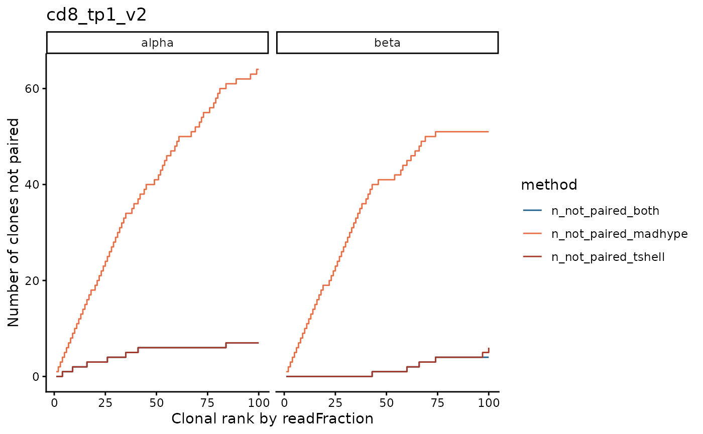

# Plot examples with SJTRC COVID-19 data

This vignette loads paired TCR TIRTLseq data from the St. Jude Tracking
Study of Immune Responses Associated with COVID-19 (SJTRC) and shows
examples of the package’s plotting functions.

## Load the package

``` r
library(TIRTLtools)
```

    ## Error in system("nvidia-smi", intern = TRUE, ignore.stderr = TRUE) : 
    ##   error in running command

``` r
library(magrittr)
library(dplyr)
```

## Load the SJTRC COVID-19 data

``` r
folder = system.file("extdata/SJTRC_TIRTL_seq_longitudinal", package = "TIRTLtools")
dir(folder)
```

    ##  [1] "cd4_tp1_v2_pseudobulk_TRA.tsv.gz" "cd4_tp1_v2_pseudobulk_TRB.tsv.gz"
    ##  [3] "cd4_tp1_v2_TIRTLoutput.tsv.gz"    "cd4_tp2_v2_pseudobulk_TRA.tsv.gz"
    ##  [5] "cd4_tp2_v2_pseudobulk_TRB.tsv.gz" "cd4_tp2_v2_TIRTLoutput.tsv.gz"   
    ##  [7] "cd4_tp3_v2_pseudobulk_TRA.tsv.gz" "cd4_tp3_v2_pseudobulk_TRB.tsv.gz"
    ##  [9] "cd4_tp3_v2_TIRTLoutput.tsv.gz"    "cd8_tp1_v2_pseudobulk_TRA.tsv.gz"
    ## [11] "cd8_tp1_v2_pseudobulk_TRB.tsv.gz" "cd8_tp1_v2_TIRTLoutput.tsv.gz"   
    ## [13] "cd8_tp2_v2_pseudobulk_TRA.tsv.gz" "cd8_tp2_v2_pseudobulk_TRB.tsv.gz"
    ## [15] "cd8_tp2_v2_TIRTLoutput.tsv.gz"    "cd8_tp3_v2_pseudobulk_TRA.tsv.gz"
    ## [17] "cd8_tp3_v2_pseudobulk_TRB.tsv.gz" "cd8_tp3_v2_TIRTLoutput.tsv.gz"

``` r
sjtrc = load_tirtlseq(folder, meta_columns = c("marker", "timepoint", "version"), sep = "_")
```

## Process the data

When we initially load the data, the data frames lack some information
that is needed for plotting functions.

The
[`TIRTL_process()`](https://nicholasclark.github.io/TIRTLtools/reference/TIRTL_process.md)
function runs 3 other package functions to add this information to the
data frames:

- [`add_single_chain_data()`](https://nicholasclark.github.io/TIRTLtools/reference/add_single_chain_data.md) -
  adds single-chain read counts/fractions to the paired TCR data frames
- [`identify_paired()`](https://nicholasclark.github.io/TIRTLtools/reference/identify_paired.md) -
  adds a column to pseudobulk data indicating which single-chains were
  paired
- [`identify_non_functional_seqs()`](https://nicholasclark.github.io/TIRTLtools/reference/identify_non_functional_seqs.md) -
  adds columns to paired data frames indicating whether CDR3A/B amino
  acid sequences are functional (not containing stop codons or
  frameshifts)

If `clean = TRUE` is specified, the
[`clean_pairs()`](https://nicholasclark.github.io/TIRTLtools/reference/clean_pairs.md)
function is also run before the preceding functions. This function
removes excess pairs for alpha and beta chains. Biologically, we expect
that each alpha is paired with at most one beta and that each beta is
paired with at most two alphas in a clone. Here we use `clean = FALSE`
to show how the data looks as-is.

``` r
sjtrc = TIRTL_process(sjtrc, clean = FALSE) 
```

    ## Adding single-chain data to paired dataframe for sample 1
    ## Adding single-chain data to paired dataframe for sample 2
    ## Adding single-chain data to paired dataframe for sample 3
    ## Adding single-chain data to paired dataframe for sample 4
    ## Adding single-chain data to paired dataframe for sample 5
    ## Adding single-chain data to paired dataframe for sample 6
    ## 
    ## Annotating data with pairing status by MAD-HYPE and T-SHELL algorithms for sample 1
    ## Annotating data with pairing status by MAD-HYPE and T-SHELL algorithms for sample 2
    ## Annotating data with pairing status by MAD-HYPE and T-SHELL algorithms for sample 3
    ## Annotating data with pairing status by MAD-HYPE and T-SHELL algorithms for sample 4
    ## Annotating data with pairing status by MAD-HYPE and T-SHELL algorithms for sample 5
    ## Annotating data with pairing status by MAD-HYPE and T-SHELL algorithms for sample 6

## Longitudinal plots for individual TCRs or groups of TCRs

For CD8-selected T-cells, we get the nucleotide sequences for the 5 most
frequent beta chains for timepoints 1 and 2 and show their frequencies
across all samples and timepoints.

We can see they are highly frequent at CD8 timepoint 3, but not in any
of the CD4 samples.

``` r
top_clones1 = sjtrc$data$cd8_tp1_v2$beta %>% arrange(desc(readFraction)) %>% head(5) %>% extract2("targetSequences") %>% as.character()
top_clones2 = sjtrc$data$cd8_tp2_v2$beta %>% arrange(desc(readFraction)) %>% head(5) %>% extract2("targetSequences") %>% as.character()

plot_clone_size_across_samples(sjtrc, clones = c(top_clones1, top_clones2), chain = "beta")
```


We can also plot the proportion of reads occupied by the 10 most
frequent clones, or the top 100, or 1000, etc for each sample.

Here we can see that the top CD8 clones occupy more of the repertoire
than their CD4 counterparts.

``` r
plot_clonotype_indices(sjtrc, chain = "beta")
```


A good robust measure of repertoire diversity is the number of clones
needed to make up half of the total reads (d50).

A higher d50 means a less clonal repertoire and a lower d50 means a
repertoire dominated by a small number of clones.

We see that the CD8 repertoire is more clonal than the CD4 and at
timepoint 2 it is the most clonal.

``` r
div = calculate_diversity(sjtrc, chain = "beta", metrics = "d50")
```

    ## 
    ## -- Calculating diversity indices for sample 1 of 6.
    ## -- Calculating diversity indices for sample 2 of 6.
    ## -- Calculating diversity indices for sample 3 of 6.
    ## -- Calculating diversity indices for sample 4 of 6.
    ## -- Calculating diversity indices for sample 5 of 6.
    ## -- Calculating diversity indices for sample 6 of 6.

``` r
plot_diversity(div, metric = "d50")
```

 The package
offers a large number of other diversity metrics, including Simpson,
inverse Simpson, Shannon, richness, etc.

For a full list of the available metrics, run
[`get_all_div_metrics()`](https://nicholasclark.github.io/TIRTLtools/reference/get_all_div_metrics.md).

``` r
get_all_div_metrics()
```

    ##  [1] "simpson"        "gini"           "gini.simpson"   "inv.simpson"   
    ##  [5] "shannon"        "berger.parker"  "richness"       "d50"           
    ##  [9] "dXX"            "renyi"          "hill"           "top10fraction" 
    ## [13] "top100fraction" "topNfraction"

We can also plot the total number of alpha and beta chain reads for each
sample.

``` r
plot_n_reads(sjtrc)
```


We can also check how many alpha and beta chains were paired for each
sample and by which algorithm.

``` r
plot_paired(sjtrc)
```


For quality control purposes, for the chains that are paired, we can
plot how many partners each was assigned.

We expect alpha chains to have at most one beta chain partner and beta
chains to have at most two alpha chain partners. Higher numbers of
partners could be indicative of problems with the pairing. Sometimes
these extra partners indicate mispairings and sometimes they are
sequencing/PCR errors of the true partner.

``` r
plot_num_partners(sjtrc)
```



We can also check the percentage of chains that are paired within each
read fraction range. We would expect good pairing for highly frequent
chains and worse pairing for rare chains.

Here we see that beta chains that are more frequent than one in
ten-thousand (0.0001, darkest three bars) are paired very well in all
samples. For rarer chains, the fraction paired drops off and almost none
of the chains in the one-in-one-hundred-thousand to one-in-one-million
range (light green, \[1e-06,1e-05\]) are paired.

``` r
plot_paired_by_read_fraction_range(sjtrc, chain = "beta")
```


We might expect that our algorithms (at least T-SHELL) are able to pair
the majority of the most frequent clones. We can check how often our
pairing algorithms fail for the top clones with a stepped line-chart
that tracks how many of the top clones we fail to pair for a given
sample.

For this CD8 sample at timepoint 1, we see that the T-SHELL algorithm is
able to pair almost all of the top 100 clones, but the MAD-HYPE
algorithm is only able to pair about half. This is expected since
MAD-HYPE calls pairs based on occurrence patterns and therefore has a
very difficult time pairing clones that are found in all or almost all
wells.

``` r
plot_paired_vs_rank(sjtrc, sample = 4)
```

 Another way
to visualize the pairing of the top clones is to plot their rank from
left to right with their read fraction on the y-axis, with points
colored by the pairing status. Here, the unpaired clones are shown by
green dots with a cross. Clones paired by only the T-SHELL algorithm are
shown in yellow. We can see again that T-SHELL works well for the most
frequent clones while the MAD-HYPE algorithm has trouble with clones
that are more frequent than one in a thousand (10^-3).

``` r
plot_read_fraction_vs_pair_status(sjtrc, sample = 4)
```

 We might
also expect that the most frequent alpha clones are paired to the most
frequent beta clones and vice versa.

This next plot shows the same information as the last one, but with both
alpha and beta clones on the same graph (the top alpha clones are
flipped to the left side). Lines between alpha clones (left) and beta
clones (right) indicate pairs.

We can see that most of the top 100 alpha clones have a partner in the
top 100 beta clones, which makes sense.

``` r
plot_pairs_with_eachother(sjtrc, sample = 1)
```


We can also plot the rank versus read fraction for all clones and
compare the shapes of these curves among samples.

We can see that the most frequent beta chains from the CD4 samples have
a frequency of around 1 in 1000 (10^-3) while the most frequent clones
from CD8 samples have a frequency of over 1%.

``` r
plot_ranks(sjtrc, chain = "beta")
```


As another quality control check, we can plot how many of the top clones
from each sample are shared in other samples.

Here we plot the overlap of the top 200 clones from each sample and see
that there is significant sharing within CD4 and CD8 samples, but not
between them, which is expected.

``` r
plot_sample_overlap(sjtrc, chain = "beta")
```


We may also want to find whether clones are expanding or contracting
in-between timepoints. Here, the CD8 clones that are expanding from
timepoint 1 to 2 are shown in orange and those that are contracting are
shown in green.

``` r
plot_sample_vs_sample(sjtrc$data$cd8_tp1_v2, sjtrc$data$cd8_tp2_v2, chain = "beta")
```


