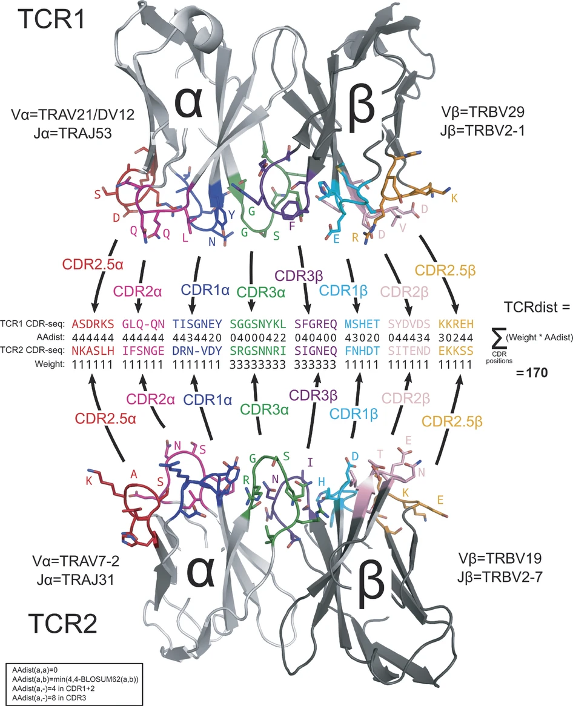

# What is TCRdist?

TCRdist ([Dash et al., Nature 2017](https://doi.org/10.1038/nature22383)) quantifies the similarity between
two T-cell receptors based on the concordance of their amino acid sequences in regions important for antigen recognition.
The algorithm computes a weighted [Hamming distance](https://en.wikipedia.org/wiki/Hamming_distance) between two TCRs, using a [BLOSUM62 substitution matrix](https://www.labxchange.org/library/items/lb:LabXchange:24d0ec21:lx_image:1) to penalize amino acids mismatches between V/J segments and CDR3 loops.

|  |
|:--:|
| <em> A schematic of TCRdist. </em> |

# Why do we need another TCRdist implementation?

TCRdist was originally implemented in Python ([tcr-dist](https://github.com/phbradley/tcr-dist)), but **computation becomes very slow when calculating pairwise TCRdist values for thousands of TCRs**. Efforts to speed up TCRdist calculation in Python have been made using [numba](https://numba.pydata.org/), a high-performance just-in-time (JIT) compiler ([tcrdist3](https://github.com/kmayerb/tcrdist3)), Cython, which compiles Python code into fast C code  ([fast_tcrdist](https://github.com/villani-lab/fast_tcrdist)), and standard C++ ([CoNGA](https://github.com/phbradley/conga)). However, none of these implementations make use of GPUs, which can outperform compiled C++ executed on a CPUs.

**We wrote a GPU-enabled TCRdist implementation in Python that is faster than all other existing implementations** (although other implementations are certainly more feature-rich). To enable use with extra-large datasets of millions of TCRs, it batches computation, keeps results in sparse format, and can progressively write results to a text file rather than returning a cumbersomely large data object.

Our implementation is compatible with both NVIDIA and Apple Silicon GPUs and automatically detects a user's GPU type. It uses [cupy](https://cupy.dev/) (for NVIDIA GPUs) or [mlx](https://ml-explore.github.io/mlx/build/html/index.html) (for Apple Silicon GPUs) to compute pairwise TCRdist for each batch of TCRs, using [numpy](https://numpy.org/) as a backup when no GPU is available.

**The `TCRdist()` function in `TIRTLtools`is a wrapper that allows us to run this fast GPU implementation via R using the [reticulate](https://rstudio.github.io/reticulate/) package.**

# Notes on our implementation

- Your input data frame must include the following columns (it may include additional columns):
  - `va` - V-segment for alpha chain
  - `cdr3a` - CDR3 amino acid sequence for alpha chain
  - `vb` - V-segment for beta chain
  - `cdr3b` - CDR3 amino acid sequence for beta chain
- Our implementation currently ignores J-segments and calculates similarity based on only V-segment and CDR3 amino acid sequence.
- Our implementation currently requires V-segments and CDR3 sequences for both alpha and beta chains. If you have single-chain data only, you can insert dummy values in the V and CDR3 columns for the missing chain to allow for compatibility with our function.
- Our implementation uses a pre-calculated substitution matrix for amino acids and V-segments. TCRs whose amino acid sequences contain stop codons (*) or frameshifts (_) and TCRs with V-segments that are not found in the substitution matrix will be dropped. For a list of permitted amino acids and V-segments, see `TIRTLtools::params$feature`.
- Our V-segments include an allele identifier, e.g. "TRAV13-1\*03". If some or all of your V-segments do not include alleles, the function will automatically add "\*01" to them.
- You may also run TCRdist directly in Python <https://github.com/NicholasClark/TCRdist_gpu>. However, the steps above of preparing the data (dropping improper TCRs and adding alleles) are not part of the Python function, so you may want to run `prep_for_tcrdist()` on your data first and write that data frame to a file.

# TCRdist example

The following example computes TCRdist values for all pairs of annotated TCRs in the [VDJdb](https://vdjdb.cdr3.net/) database. It outputs all values with TCRdist <= 90.

## Load the package

```{r message=FALSE,warning=FALSE}
library(TIRTLtools)
library(dplyr)
library(rmarkdown)
```

## Load an example dataset (annotated TCRs from VDJ-db)

```{r}
tcr1 = TIRTLtools::vdj_db
### note: You may replace this with a file of your choice - needs to have columns "va", "vb", "cdr3a", and "cdr3b"

paged_table(tcr1)
```

## Run TCRdist

```{r}
result = TCRdist(tcr1 = tcr1, tcrdist_cutoff = 90, chunk_size = 5000)
```

## Inspect the output

```{r}
edge_df = result[['TCRdist_df']] ### table of TCRdist values <= cutoff
meta_df = result[['tcr1']] ### table of input data with indices

paged_table(edge_df)
paged_table(meta_df)
```
